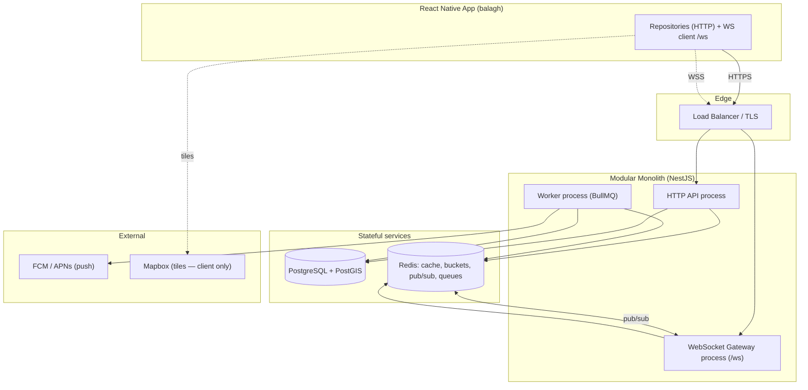
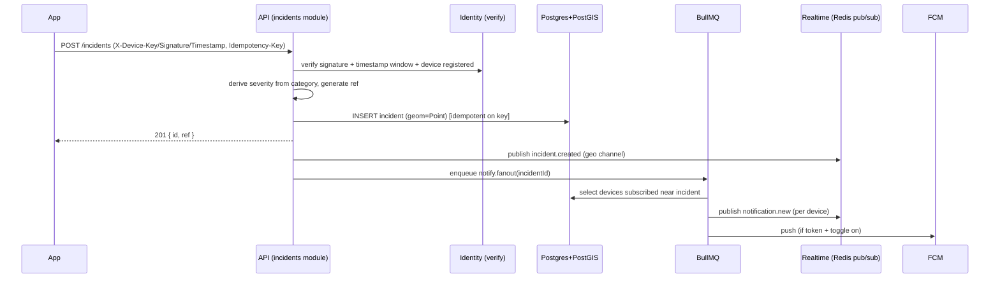
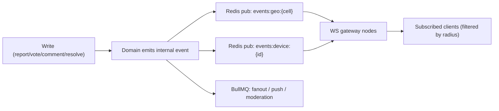
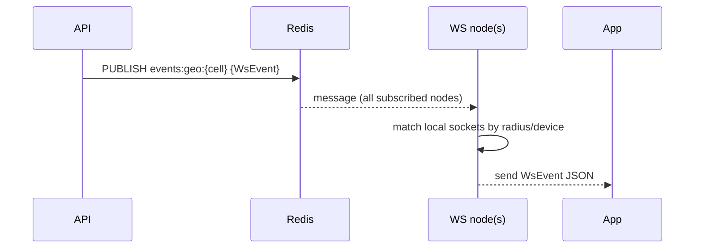
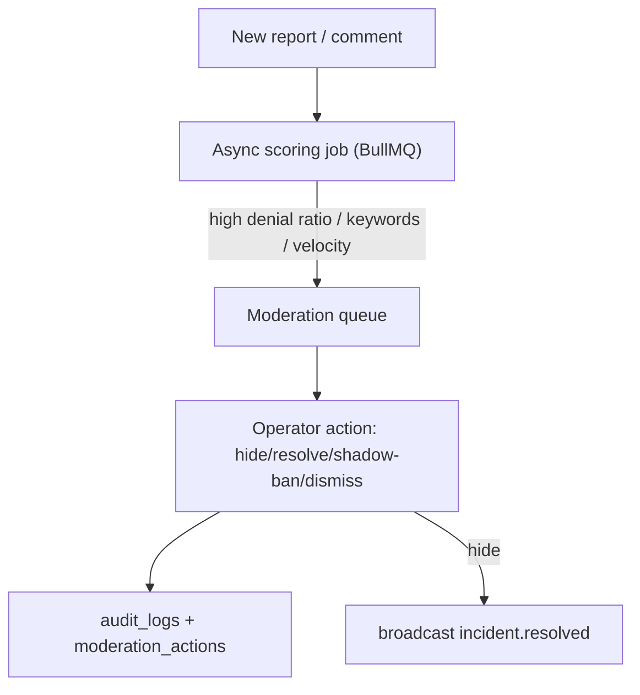

# Balagh — Backend Architecture Specification (`BackendSpecs.md`)

> **Status:** Implementation-ready blueprint.
> **Scope:** Backend services that replace the React Native app's mock data layer
> (`src/data/mock/*`) with real, production services — preserving the existing
> repository interfaces and data contracts byte-for-byte.
> **Source of truth:** the shipped frontend code under
> `mobile/frontend/Balagh/src/**` and the product spec
> `BalaghCompleteSpecReactNative.md`. This document does **not** redesign the
> product; it designs a backend that perfectly serves the app as built.

> **Note on naming:** There is no separate `FrontendSpecs.md` in the repo. The
> canonical frontend specification is `BalaghCompleteSpecReactNative.md`
> (§10 “Mock API contract”, §11 “Device identity”). All contracts in this
> document are derived from that spec **and verified against the live TypeScript
> source** (the source wins on any discrepancy).

---

## Table of Contents

1. [Frontend Analysis](#1-frontend-analysis)
2. [Backend Requirements](#2-backend-requirements)
3. [Architecture Overview](#3-architecture-overview)
4. [Recommended Technology Stack](#4-recommended-technology-stack)
5. [Project Structure](#5-project-structure)
6. [Database Design](#6-database-design)
7. [API Design](#7-api-design)
8. [Realtime Architecture](#8-realtime-architecture)
9. [Security Architecture](#9-security-architecture)
10. [Infrastructure](#10-infrastructure)
11. [Development Phases (with AI build prompts)](#11-development-phases)
12. [Final Recommendation](#12-final-recommendation)

---

## 1. Frontend Analysis

### 1.1 Application purpose

**Balagh (بلاغ)** is a privacy-first, anonymous, civilian incident-reporting app
for Arabic-speaking communities in Israel (full Hebrew + English support). Users
report safety incidents (gunfire, stabbing, assault, robbery, suspicious
activity, other), see them live on a map and in a feed, confirm/deny others'
reports, comment with a deterministic anonymous identity, receive geo-targeted
notifications, and get a computed neighbourhood safety state (calm / watch /
active). There is **zero personal data, zero accounts, zero police/state
integration, and zero audio**.

These constraints are not cosmetic — they are **hard backend constraints**: the
backend must never require or store PII, never expose an identity-to-report
linkage, and never integrate any government endpoint.

### 1.2 User journeys

| Journey | Screens (source) | Backend touchpoints |
|---|---|---|
| **Onboarding** | `screens/onboarding/Language.tsx`, `Welcome.tsx`, `Locality.tsx` | `GET /localities?q=` (search), device registration |
| **Map (home)** | `screens/Map.tsx` | `GET /incidents`, `GET /status`, `WS /ws` |
| **Feed** | `screens/Feed.tsx` | `GET /incidents`, `WS /ws` (`incident.created`, `vote.updated`, `incident.resolved`) |
| **Incident detail** | `screens/IncidentDetail.tsx` | `GET /incidents/:id`, `GET/POST /incidents/:id/comments`, `POST /incidents/:id/vote` |
| **Report (standard)** | `screens/ReportCategory.tsx`, `ReportDetails.tsx`, `ReportSuccess.tsx` | `POST /incidents` |
| **Crisis one-shot (≤3 taps)** | `screens/crisis/CrisisReassure/Category/Confirm/Success.tsx` | `POST /incidents` (deep link `balagh://crisis`) |
| **Notifications inbox** | `screens/Inbox.tsx` | `GET /notifications`, `POST /notifications/read`, `WS notification.new` |
| **Follow-up** | `screens/FollowUp.tsx` | `POST /follow-up/:ref` |
| **Settings / privacy** | `screens/settings/*` | device identity, notification toggles, delete-my-data |

### 1.3 Reporting flow

Derived from `MockIncidentRepo.submitReport()` + `ReportDetails.tsx` +
`crisis/CrisisConfirm.tsx`:

1. User picks a **category** (`CategoryGrid.tsx`) → severity is **derived from
   category** on submit (the client never sets severity directly).
2. Optional **description** (≤200 chars).
3. Client acquires a **GPS fix** (`lat`, `lng`) — or falls back to the selected
   locality centroid.
4. `submitReport(category, lat, lng, description?)` → returns `{ id, ref }`
   (`ref` like `BLG-7Q2K9X`).
5. On success the client emits/expects an `incident.created` WebSocket event so
   the map pin and feed update live (`MockIncidentRepo` calls
   `wsEventEmitter.emit({ t:'incident.created', incident })`).
6. **Severity map (authoritative, must be replicated server-side):**
   `GUNFIRE,STABBING → critical`; `ASSAULT,ROBBERY → high`;
   `SUSPICIOUS,OTHER → medium` (`MockIncidentRepo.SEVERITY_MAP`).
7. **Offline:** reports are queued under `StorageKeys.PENDING_REPORTS` and
   replayed on reconnect → backend needs **idempotency** to dedupe replays.

### 1.4 Voting flow

Derived from `MockIncidentRepo.vote()` + `IncidentDetail.tsx`:

- One vote per device per incident, **one-way / irreversible** (`myVote` becomes
  non-null and cannot change).
- Optimistic UI; server returns the updated `Incident`.
- **Duplicate vote → HTTP 409** → client shows an “already voted” toast
  (`s.detail.alreadyVoted`).
- Aggregates `confirmations` / `denials` are returned on the incident and
  broadcast via `vote.updated`.

### 1.5 Comment flow

Derived from `MockIncidentRepo.getComments/addComment` + `IncidentDetail.tsx`:

- Comments belong to an incident; each carries a deterministic **3-emoji
  identity tag** (`identityTag: [string,string,string]`) computed from the
  device identity via `deriveEmojis(hex)` — **same device ⇒ same tag**
  everywhere. This must be reproduced server-side (palette + slicing below).
- Body **≤280 chars**; `commentCount` on the incident is incremented.
- No edit/delete in the UI.

### 1.6 Notification flow

Derived from `MockNotificationRepo`, `Inbox.tsx`, `domain/utils/notifications.ts`,
`domain/services/notifications.ts`:

- Four types: `nearby`, `verification`, `status`, `follow_up`.
- Inbox groups by **Today / Yesterday / This Week / older date buckets**, shows
  unread crimson dots, supports **mark-all-read**.
- `GET /notifications`, `POST /notifications/read` (mark a set read),
  `markAllRead`.
- New notifications arrive live via `WS notification.new`.
- Device-level **toggles** (persisted): `notif_nearby`, `notif_status`,
  `notif_followup` (`StorageKeys`). Push permission is Android 13+
  `POST_NOTIFICATIONS`, requested only when a toggle is enabled.

### 1.7 Map flow

Derived from `Map.tsx`:

- Full-bleed Mapbox canvas, dark style, north-up. Renders **mock `db.incidents`
  as severity-tinted pins/clusters**; recenters on the user; computes a derived
  **calm/watch/active** status dot.
- Reads `GET /incidents?lat&lng&radiusKm` and subscribes to `WS` for
  `incident.created` and `status.changed`.
- Mapbox tiles/styles are served by **Mapbox** (token in app); the backend does
  **not** serve map tiles — it serves the **geospatial incident data** that the
  client overlays.

### 1.8 Realtime flow

Derived from `data/mock/eventEmitter.ts` + `Map.tsx` + `Feed.tsx`:

- A single WebSocket at **`/ws`** (`config.ts WS_URL = …/ws`).
- Event union (`core/types WsEvent`) — **the exact wire contract**:
  ```ts
  type WsEvent =
    | { t: 'incident.created';  incident: Incident }
    | { t: 'incident.resolved'; id: string }
    | { t: 'status.changed';    state: SafetyState; reason: string }
    | { t: 'vote.updated';      id: string; confirmations: number; denials: number }
    | { t: 'notification.new';  notification: AppNotification };
  ```
- Clients subscribe implicitly by geography; `notification.new` is **targeted**
  to the owning device.

### 1.9 Offline flow

Derived from `domain/stores/net.ts` + `StorageKeys.PENDING_REPORTS` +
`components/OfflineBanner.tsx` + `components/UpdateGate.tsx` +
`domain/utils/updateGate.ts`:

- `net` store latches `wasOffline`; a global banner shows offline / reconnected.
- Reports created offline are queued and **replayed on reconnect** → backend
  **idempotency keys** required.
- **HTTP 426** anywhere → non-dismissable **update gate**
  (`shouldGateForStatus(426)`); backend must return 426 for unsupported client
  versions.

### 1.10 Frontend files & modules used to derive this analysis

```
core/types/index.ts            # Incident, Comment, AppNotification, Locality, StatusResponse, WsEvent, ApiError
core/config.ts                 # API_BASE_URL, WS_URL, radii/windows/threshold constants
core/identity/index.ts         # 32-byte hex identity, signRequest() stub, deriveEmojis(), getPublicIdentifier()
core/storage/index.ts          # StorageKeys (PENDING_REPORTS, notif toggles, READ_INCIDENTS, …)
domain/status/index.ts         # computeStatus() + haversineKm() — safety-state rules
domain/utils/notifications.ts  # groupNotifications(), unreadCount()
domain/utils/updateGate.ts     # shouldGateForStatus(426)
domain/services/notifications.ts # POST_NOTIFICATIONS permission gating
domain/stores/{net,map,onboarding,bookmarks,lang}.ts
data/repositories/interfaces.ts  # I{Incident,Notification,Locality,Status}Repository  ← the API surface
data/mock/{db,MockIncidentRepo,MockNotificationRepo,MockLocalityRepo,MockStatusRepo,eventEmitter}.ts
screens/** (Map, Feed, IncidentDetail, Report*, crisis/*, Inbox, FollowUp, settings/*, onboarding/*)
```

---

## 2. Backend Requirements

### 2.1 Functional requirements (FR)

| # | Requirement | Derived from |
|---|---|---|
| FR-1 | List nearby incidents by `(lat, lng, radiusKm)`, active + recently-resolved | `IIncidentRepository.getIncidents`, `GET /incidents` |
| FR-2 | Fetch a single incident by id | `getIncident`, `GET /incidents/:id` |
| FR-3 | Submit a report; derive severity from category; generate `ref`; persist geometry | `submitReport`, `POST /incidents` |
| FR-4 | One-way vote (confirm/deny), one per device, 409 on duplicate, return updated incident | `vote`, `POST /incidents/:id/vote` |
| FR-5 | List comments for an incident | `getComments`, `GET /incidents/:id/comments` |
| FR-6 | Add comment (≤280), attach deterministic 3-emoji tag, bump `commentCount` | `addComment`, `POST /incidents/:id/comments` |
| FR-7 | Compute safety status for a point (calm/watch/active + reason) | `IStatusRepository.getStatus`, `domain/status` |
| FR-8 | Search localities across ar/he/en | `searchLocalities`, `GET /localities?q=` |
| FR-9 | List a device's notifications; mark read; mark all read | `INotificationRepository`, `/notifications*` |
| FR-10 | Accept follow-up details for a `ref` | `FollowUp.tsx`, `POST /follow-up/:ref` |
| FR-11 | Broadcast realtime events (`incident.created/resolved`, `vote.updated`, `status.changed`, `notification.new`) | `WsEvent`, `/ws` |
| FR-12 | Generate & deliver notifications (geo fan-out + follow-up + verification + status) | notification types |
| FR-13 | Moderation: hide/resolve incidents, shadow-ban abusive devices, review queue | privacy/safety posture |
| FR-14 | Idempotent report submission (offline replay) | `PENDING_REPORTS` |
| FR-15 | Version gate: return 426 to unsupported clients | `updateGate` |
| FR-16 | Anonymous device registration + optional push-token storage | `core/identity`, notifications |

### 2.2 Non-functional requirements (NFR)

- **NFR-1 Latency:** p95 < 150 ms for reads (geo queries), < 300 ms for writes
  (the app shows skeletons/optimistic UI; aim better than the mock’s 300–800 ms).
- **NFR-2 Availability:** 99.9% for the API; WS reconnection tolerated by client.
- **NFR-3 Consistency:** vote/comment counters must be transactionally correct.
- **NFR-4 Scalability:** horizontal stateless API + WS nodes; geo-sharded fan-out.
- **NFR-5 Maintainability:** modular monolith, strict TS, one repo, typed
  contracts shared with the app.
- **NFR-6 Low ops:** a single deployable + Postgres + Redis; no microservice mesh.
- **NFR-7 Observability:** structured logs, metrics, traces, health checks.
- **NFR-8 Portability:** Docker; cloud-agnostic; managed Postgres/Redis swappable.

### 2.3 Security requirements

- **SEC-1 Zero PII:** no column may store phone/email/name/login. Enforced by
  schema review + a CI lint of the migration files.
- **SEC-2 Anonymous identity:** device identified only by a public key / hex id
  (`X-Device-Key`); reports are **never** queryable by identity through any
  public endpoint.
- **SEC-3 Signed mutations:** `X-Device-Key` + `X-Signature` + `X-Timestamp`
  (replay-protected). Ed25519-ready; HMAC fallback documented.
- **SEC-4 Rate limiting & anti-spam:** per-device + per-IP token buckets on
  writes (reports/votes/comments).
- **SEC-5 Abuse/fraud prevention:** vote uniqueness, content moderation,
  geo-velocity checks, shadow-ban.
- **SEC-6 Audit logging:** every moderation/admin action is appended to an
  immutable audit log.
- **SEC-7 Transport:** TLS everywhere; WSS in production.
- **SEC-8 No location history:** the backend stores incident locations (needed
  to render them) but **never** a per-device location trail.

### 2.4 Scalability requirements

- Stateless API and WS tiers behind a load balancer; sessions/state in Redis.
- Geospatial reads via PostGIS GiST indexes; hot localities cached in Redis.
- WS fan-out via **Redis Pub/Sub** so any node can deliver any event.
- Async work (push delivery, geo notification fan-out, moderation scoring) via
  **BullMQ** queues with retries.

### 2.5 Realtime requirements (mapping)

| Frontend trigger | Backend event | Delivery |
|---|---|---|
| New report created | `incident.created` | Broadcast to subscribers within radius of the incident |
| Incident resolved/hidden | `incident.resolved` | Broadcast (geo) |
| Vote tally changes | `vote.updated` | Broadcast (geo, incident locality) |
| Safety state recomputed | `status.changed` | Broadcast to devices whose reference point changed bucket |
| Notification generated | `notification.new` | **Targeted** to the owning device's socket(s) |

---

## 3. Architecture Overview

### 3.1 System overview

A **Modular Monolith**: a single Node.js/TypeScript deployable (NestJS) split
into clear domain modules with enforced boundaries, plus a co-deployed WebSocket
gateway and a background worker process (same codebase, different entrypoint).
PostgreSQL + PostGIS is the system of record; Redis provides cache, rate-limit
buckets, BullMQ queues, and WS pub/sub.

> **Why modular monolith, not microservices?** The domain is small and tightly
> coupled (incidents ↔ votes ↔ comments ↔ notifications ↔ status all share the
> incident aggregate and geography). Microservices would add network hops,
> distributed transactions for counters, and operational overhead with no
> scaling benefit at this size. The monolith is split into modules with explicit
> interfaces so a service can be extracted later **only if** a real bottleneck
> appears (the realtime gateway is the most likely future split — already
> isolated as its own process).



### 3.2 Service boundaries (modules)

```
identity     device registration, key storage, signature verification, emoji-tag
incidents    reports, geo queries, severity derivation, ref generation, resolve
votes        one-way voting, counters, 409 dedupe
comments     threaded comments, emoji identity tag, count maintenance
status       safety-state computation + status history + status.changed events
localities   seed + search (ar/he/en) + centroids
notifications inbox, read-state, geo fan-out, follow-ups, push transport
moderation   review queue, hide/resolve, shadow-ban, content scoring
realtime     WS gateway, subscription registry, broadcast (geo + targeted)
admin        operator endpoints (moderation, metrics, audit)
shared       config, logging, errors, validation, db, redis, types
```

### 3.3 Domain boundaries

`incidents` is the **aggregate root**. `votes`, `comments`, `status`, and
`notifications` reference incidents but own their tables and invariants.
Cross-module calls go through **module service interfaces** (not direct table
access), so a module can be tested and later extracted in isolation.

### 3.4 Request flow (write example: submit report)



### 3.5 Event flow



---

## 4. Recommended Technology Stack

> Selection criteria, in priority order: **(a)** exact-match the existing wire
> contract (raw `/ws` JSON, unsigned-today/signed-later auth), **(b)** first-class
> geospatial, **(c)** low operational complexity, **(d)** TS end-to-end,
> **(e)** scalability headroom.

### 4.1 Summary (final picks)

| Concern | Choice | One-line reason |
|---|---|---|
| Language/Runtime | **Node.js 22 LTS + TypeScript 5.x (strict)** | Shares types/contract with the RN app |
| Framework | **NestJS 11 (Fastify adapter)** | Enforces modular-monolith boundaries via DI + modules |
| DB | **PostgreSQL 16 + PostGIS 3.4** | Native geospatial (`ST_DWithin`, GiST) — the core query pattern |
| ORM / migrations | **Drizzle ORM** | SQL-first; clean PostGIS via custom column types; no heavy engine |
| Cache / buckets / pub-sub | **Redis 7** | One service covers cache, rate limit, WS fan-out, queues |
| Queue | **BullMQ** | Redis-backed; retries/backoff for push + fan-out; no new infra |
| Realtime | **`ws` (raw WebSocket) at `/ws` + Redis Pub/Sub** | Matches the RN plain-WS client exactly; horizontally scalable |
| Validation | **Zod** | Runtime schema + inferred TS types; single source for DTOs |
| Logging | **Pino** | Fast structured JSON logs |
| Push | **FCM (Android) + APNs (iOS)** behind a `PushTransport` interface | Standard; swappable for UnifiedPush (privacy-max) |
| Object storage | **None for MVP** (S3/R2 only if exports/backups need it) | App collects no media (no camera) — see 4.8 |
| Deploy | **Docker → Fly.io/Railway (MVP) → AWS ECS Fargate (scale)** | Low ops now, clear scale path |

### 4.2 Framework — NestJS vs Fastify-plain vs Express

| | NestJS (Fastify) ✅ | Fastify plain | Express |
|---|---|---|---|
| Modular boundaries | **Built-in (modules/DI)** | Manual | Manual |
| Realtime/Queues | Adapters + clean DI | DIY | DIY |
| Boilerplate | Some | Low | Low |
| Fit for modular monolith | **Excellent** | OK | Poor at scale |

**Why NestJS:** the task mandates a modular monolith; Nest’s module system makes
domain boundaries explicit and testable, and its lifecycle fits the
API/WS/worker tri-process layout. Fastify adapter keeps throughput high.

### 4.3 Database — PostgreSQL+PostGIS vs Mongo vs “Postgres only”

The dominant query is **“active incidents within R km of (lat,lng)”** plus
windowed counts for status. PostGIS makes this a single indexed
`ST_DWithin(geom, ST_MakePoint(lng,lat)::geography, radius_m)`. MongoDB’s geo is
weaker for the relational joins (votes/comments/counters) and transactions we
need. Plain Postgres without PostGIS forces bounding-box math in app code (what
the mock’s `haversineKm` does) — fine for a mock, wrong for production scale.
**PostGIS wins decisively.**

### 4.4 ORM — Drizzle vs Prisma vs TypeORM

| | Drizzle ✅ | Prisma | TypeORM |
|---|---|---|---|
| PostGIS geometry | **Custom type + raw SQL, clean** | Needs `Unsupported`/raw | Spatial columns, heavier |
| Type-safety | Excellent (infer) | Excellent | Good |
| Migrations | SQL-first, transparent | Great DX, opaque engine | Mixed |
| Footprint | Tiny | Query engine binary | Larger |

**Why Drizzle:** geospatial work is SQL-heavy; Drizzle keeps queries explicit and
type-safe without fighting an ORM abstraction. *(Prisma is the documented
fallback if the team prefers its migration DX — use `prisma` for modeling +
raw SQL for geo.)*

### 4.5 Cache — Redis (and why one Redis covers a lot)

Redis 7 serves four roles, keeping ops minimal: **(1)** response cache for hot
geo tiles/localities, **(2)** token-bucket rate limiting, **(3)** Pub/Sub for WS
fan-out across nodes, **(4)** BullMQ backing store. One managed Redis instance
(Upstash/ElastiCache) — no separate broker.

### 4.6 Queue — BullMQ vs Kafka vs SQS

BullMQ (Redis) is right-sized: retries/backoff/delayed jobs for **push delivery,
geo notification fan-out, moderation scoring, status recompute**. Kafka/SQS add
infra with no benefit at this volume. Revisit only if event volume reaches
millions/day.

### 4.7 Realtime — raw `ws` vs Socket.IO

**Constraint:** the RN client connects to `WS_URL = …/ws` with a **plain
WebSocket** and parses `WsEvent` JSON. Socket.IO uses a custom framing/handshake
protocol the client doesn’t speak. Therefore the backend **must** expose a raw
WebSocket server at `/ws`. Horizontal scale comes from **Redis Pub/Sub**: each
gateway node subscribes to geo channels and the per-device channel, and forwards
matching events to its local sockets. (If the client were ever rewritten to use
Socket.IO, its Redis adapter would be an option — not today.)

### 4.8 Object storage — evaluated, **not required for MVP**

The app has **no camera/microphone/photo permissions** and submits **no media**
(reports are category + text + coordinates). So there is no user-content object
storage need. Reserve an **S3-compatible bucket (Cloudflare R2 / AWS S3)** only
for operational artefacts later (DB backups, moderation CSV exports, log
archives). Listed here for completeness; **omit from the MVP build**.

### 4.9 Push — FCM/APNs behind an interface

Frontend deferred Firebase to keep cold-start clean; the **backend** owns
transport. Define `PushTransport` with `send(deviceToken, payload)`; implement
**FCM** (Android) and **APNs** (iOS). Keep payloads **data-only** so the client
renders locally (privacy + zero-sound). Document **UnifiedPush** as the
privacy-max swap (same interface).

### 4.10 Deployment

- **MVP / low-ops:** Docker image on **Fly.io** or **Railway**; **Neon** or
  **Supabase** for Postgres+PostGIS; **Upstash** for Redis. Near-zero ops.
- **Scale:** **AWS ECS Fargate** (API/WS/worker services) + **RDS Postgres
  (PostGIS)** + **ElastiCache Redis** + ALB. Same Docker image, three task
  definitions (different `CMD`/entrypoint).

---

## 5. Project Structure

```
mobile/backend/
├─ BackendSpecs.md
├─ package.json
├─ tsconfig.json                  # strict
├─ drizzle.config.ts
├─ docker-compose.yml             # local: postgres+postgis, redis
├─ Dockerfile
├─ .env.example
├─ src/
│  ├─ main.api.ts                 # entrypoint: HTTP API process
│  ├─ main.ws.ts                  # entrypoint: WebSocket gateway process
│  ├─ main.worker.ts              # entrypoint: BullMQ worker process
│  ├─ app.module.ts               # root Nest module wiring all domain modules
│  │
│  ├─ shared/                     # cross-cutting, no domain logic
│  │  ├─ config/                  # typed env loader (Zod-validated)
│  │  ├─ logger/                  # Pino setup + request-id middleware
│  │  ├─ errors/                  # AppError, error filter → { code, message }, 426 gate
│  │  ├─ validation/             # Zod pipe, shared schemas
│  │  ├─ db/                      # Drizzle client, schema, migrations, PostGIS helpers
│  │  ├─ redis/                   # ioredis client factory (cache/pub-sub/bull)
│  │  ├─ queue/                   # BullMQ queue + worker registration
│  │  ├─ geo/                     # haversine, geohash/cell helpers, point builders
│  │  └─ contracts/               # shared TS types mirroring app core/types (Incident, WsEvent…)
│  │
│  ├─ modules/
│  │  ├─ identity/                # device registration, signature verify, deriveEmojis
│  │  ├─ incidents/               # controller, service, repo, severity map, ref gen
│  │  ├─ votes/                   # controller, service, repo, one-way + 409
│  │  ├─ comments/                # controller, service, repo, emoji tag, count
│  │  ├─ status/                  # service (computeStatus), history, status.changed
│  │  ├─ localities/              # controller, service, seed, search
│  │  ├─ notifications/           # controller, service, fan-out, push transport
│  │  ├─ followups/               # controller, service (POST /follow-up/:ref)
│  │  ├─ moderation/              # queue, actions, shadow-ban, scoring
│  │  ├─ realtime/                # WS gateway, subscription registry, broadcaster
│  │  └─ admin/                   # operator endpoints, audit reads
│  │
│  └─ jobs/                       # BullMQ processors: notify.fanout, push.send, status.recompute, moderation.score
├─ test/
│  ├─ unit/                       # services, severity map, status rules, emoji tag
│  ├─ integration/                # API + DB (testcontainers: postgis+redis)
│  └─ e2e/                        # full flow: report→ws→notify→vote→comment
└─ scripts/                       # seed localities, generate keys, migrate
```

**Folder responsibilities (key ones):**
- `shared/contracts` — the **single source of truth** for wire types; kept
  identical to the app's `core/types`. (Optionally published as an internal
  package the app imports.)
- `shared/db` — Drizzle schema + PostGIS column type + migration runner.
- `modules/*` — each module: `*.controller.ts` (HTTP), `*.gateway.ts` (WS, only
  realtime), `*.service.ts` (logic), `*.repository.ts` (SQL), `*.schema.ts`
  (Zod DTOs), `*.events.ts` (internal event names).
- `jobs/*` — idempotent BullMQ processors; one concern each.
- `main.{api,ws,worker}.ts` — three entrypoints, **one image**.

---

## 6. Database Design

### 6.1 ERD

```mermaid
erDiagram
  LOCALITIES ||--o{ INCIDENTS : "localityId"
  INCIDENTS  ||--o{ VOTES : "incidentId"
  INCIDENTS  ||--o{ COMMENTS : "incidentId"
  INCIDENTS  ||--o{ FOLLOW_UPS : "ref"
  INCIDENTS  ||--o{ INCIDENT_STATUS_HISTORY : "incidentId"
  DEVICES    ||--o{ VOTES : "deviceId"
  DEVICES    ||--o{ COMMENTS : "deviceId"
  DEVICES    ||--o{ NOTIFICATIONS : "deviceId"
  DEVICES    ||--o{ DEVICE_PUSH_TOKENS : "deviceId"
  DEVICES    ||--o{ DEVICE_SUBSCRIPTIONS : "deviceId"
  DEVICES    ||--o{ MODERATION_ACTIONS : "targetDeviceId"
  INCIDENTS  ||--o{ MODERATION_ACTIONS : "targetIncidentId"
  STATUS_SNAPSHOTS }o--|| LOCALITIES : "localityId"
  AUDIT_LOGS }o--|| DEVICES : "actorDeviceId (nullable)"

  LOCALITIES {
    text id PK
    text name_ar
    text name_he
    text name_en
    double lat
    double lng
    geography geom
  }
  INCIDENTS {
    uuid id PK
    text ref UK
    text category
    text severity
    text description
    double lat
    double lng
    geography geom
    text locality_id FK
    text status "active|resolved|hidden"
    int confirmations
    int denials
    int comment_count
    timestamptz created_at
    timestamptz resolved_at
    uuid created_by_device FK "private, never exposed"
    text idempotency_key UK
  }
  VOTES {
    uuid id PK
    uuid incident_id FK
    uuid device_id FK
    text vote "confirm|deny"
    timestamptz created_at
  }
  COMMENTS {
    uuid id PK
    uuid incident_id FK
    uuid device_id FK "private"
    text identity_tag "3 emoji, JSON array"
    text body
    timestamptz created_at
  }
  NOTIFICATIONS {
    uuid id PK
    uuid device_id FK
    text type "nearby|verification|status|follow_up"
    text title
    text body
    text incident_ref
    boolean read
    timestamptz created_at
  }
  DEVICES {
    uuid id PK
    text device_key UK "hex / Ed25519 public key"
    text status "active|shadow_banned|banned"
    timestamptz created_at
    timestamptz last_seen_at
  }
  DEVICE_PUSH_TOKENS {
    uuid id PK
    uuid device_id FK
    text platform "android|ios"
    text token
    timestamptz updated_at
  }
  DEVICE_SUBSCRIPTIONS {
    uuid device_id PK_FK
    text locality_id FK
    double lat
    double lng
    int radius_km
    boolean notif_nearby
    boolean notif_status
    boolean notif_followup
    timestamptz updated_at
  }
  FOLLOW_UPS {
    uuid id PK
    text ref FK
    text vehicle "yes|no|null"
    text assailants "1|2|3+|null"
    text direction "north|south|east|west|null"
    text weapon "yes|no|null"
    timestamptz created_at
  }
  INCIDENT_STATUS_HISTORY {
    uuid id PK
    uuid incident_id FK
    text from_status
    text to_status
    text reason
    timestamptz changed_at
  }
  STATUS_SNAPSHOTS {
    uuid id PK
    text locality_id FK
    text state "calm|watch|active"
    text reason
    timestamptz computed_at
  }
  MODERATION_ACTIONS {
    uuid id PK
    text action "hide|resolve|shadow_ban|unban|dismiss"
    uuid target_incident_id FK
    uuid target_device_id FK
    text reason
    text actor "admin id / system"
    timestamptz created_at
  }
  AUDIT_LOGS {
    uuid id PK
    text actor
    text action
    jsonb metadata
    timestamptz created_at
  }
```

### 6.2 Schema highlights (DDL sketch)

```sql
CREATE EXTENSION IF NOT EXISTS postgis;

CREATE TABLE localities (
  id       text PRIMARY KEY,                 -- slug, e.g. 'umm-al-fahm'
  name_ar  text NOT NULL,
  name_he  text NOT NULL,
  name_en  text NOT NULL,
  lat      double precision NOT NULL,
  lng      double precision NOT NULL,
  geom     geography(Point,4326) NOT NULL
);

CREATE TABLE incidents (
  id              uuid PRIMARY KEY DEFAULT gen_random_uuid(),
  ref             text UNIQUE NOT NULL,        -- 'BLG-XXXXXX'
  category        text NOT NULL CHECK (category IN
                   ('GUNFIRE','STABBING','ASSAULT','ROBBERY','SUSPICIOUS','OTHER')),
  severity        text NOT NULL CHECK (severity IN ('critical','high','medium','low')),
  description     text CHECK (char_length(description) <= 200),
  lat             double precision NOT NULL,
  lng             double precision NOT NULL,
  geom            geography(Point,4326) NOT NULL,
  locality_id     text REFERENCES localities(id),
  status          text NOT NULL DEFAULT 'active' CHECK (status IN ('active','resolved','hidden')),
  confirmations   integer NOT NULL DEFAULT 0,
  denials         integer NOT NULL DEFAULT 0,
  comment_count   integer NOT NULL DEFAULT 0,
  created_at      timestamptz NOT NULL DEFAULT now(),
  resolved_at     timestamptz,
  created_by_device uuid REFERENCES devices(id),  -- PRIVATE; never returned by public API
  idempotency_key text UNIQUE                      -- offline-replay dedupe
);

CREATE TABLE votes (
  id          uuid PRIMARY KEY DEFAULT gen_random_uuid(),
  incident_id uuid NOT NULL REFERENCES incidents(id) ON DELETE CASCADE,
  device_id   uuid NOT NULL REFERENCES devices(id),
  vote        text NOT NULL CHECK (vote IN ('confirm','deny')),
  created_at  timestamptz NOT NULL DEFAULT now(),
  UNIQUE (incident_id, device_id)                  -- enforces one-way / 409
);
```

### 6.3 Relationships, constraints, invariants

- `votes(incident_id, device_id)` **UNIQUE** → duplicate vote raises a unique
  violation the service maps to **HTTP 409** (matches `MockIncidentRepo.vote`).
- `incidents.confirmations/denials/comment_count` are **denormalized counters**
  maintained in the same transaction as the `votes`/`comments` insert (source of
  truth = child tables; counters = read accelerator). A nightly job reconciles.
- `incidents.idempotency_key` **UNIQUE** → replayed offline reports return the
  original `{id, ref}` instead of duplicating.
- `description ≤ 200`, `comments.body ≤ 280` enforced by CHECK + Zod.
- `created_by_device` is **never** selected into any public DTO (privacy).

### 6.4 Indexes

```sql
CREATE INDEX idx_incidents_geom        ON incidents USING GIST (geom);
CREATE INDEX idx_incidents_active_time ON incidents (status, created_at DESC);
CREATE INDEX idx_incidents_locality    ON incidents (locality_id);
CREATE INDEX idx_localities_geom       ON localities USING GIST (geom);
CREATE INDEX idx_votes_incident        ON votes (incident_id);
CREATE INDEX idx_comments_incident_time ON comments (incident_id, created_at);
CREATE INDEX idx_notifications_device_time ON notifications (device_id, created_at DESC);
CREATE INDEX idx_notifications_unread  ON notifications (device_id) WHERE read = false;
-- Trigram search for locality names across scripts:
CREATE EXTENSION IF NOT EXISTS pg_trgm;
CREATE INDEX idx_localities_name_trgm  ON localities
  USING gin ((name_ar || ' ' || name_he || ' ' || name_en) gin_trgm_ops);
```

### 6.5 Geospatial strategy

- Store both `lat/lng` (for direct DTO output — the app reads `incident.lat/lng`)
  **and** a `geography(Point,4326)` `geom` (for indexed distance queries). Keep
  them consistent via a trigger or in the insert.
- **Nearby query** (`GET /incidents`):
  ```sql
  SELECT … FROM incidents
  WHERE status <> 'hidden'
    AND (status = 'active' OR resolved_at > now() - interval '60 minutes')
    AND ST_DWithin(geom, ST_MakePoint($lng,$lat)::geography, $radiusKm*1000)
  ORDER BY created_at DESC;
  ```
- **Status windows** reuse `ST_DWithin` with the §1.x radii/windows from
  `config.ts` (1 km/15 min active, 3 km/60 min watch, threshold 3, confirmations
  ≥ 1).
- **WS geo-routing:** map each point to a coarse **geohash cell** (≈ a few km);
  publish events to `events:geo:{cell}` plus neighbour cells so radius queries on
  the edge still match.

---

## 7. API Design

**Conventions**
- Base URL: `https://api.balagh.app` (dev `http://localhost:3000`).
- Content-Type `application/json`. All responses match the app’s `core/types`.
- **Mutations** send headers: `X-Device-Key`, `X-Signature`, `X-Timestamp`
  (unix ms), and `Idempotency-Key` (writes that can be replayed offline).
- **Errors:** JSON `{ "code": string, "message": string }` (matches `ApiError`).
  - `426 UPGRADE_REQUIRED` → non-dismissable update gate.
  - `409 DUPLICATE_VOTE` → “already voted” toast.
  - `429 RATE_LIMITED`, `400 VALIDATION_ERROR`, `404 NOT_FOUND`,
    `401 BAD_SIGNATURE`, `403 DEVICE_BANNED`.
- Validation via **Zod**; every endpoint lists its schema.

### 7.1 Incidents

#### `GET /incidents?lat&lng&radiusKm`
- **Purpose:** nearby active + recently-resolved incidents.
- **Query (Zod):** `lat: number(-90..90)`, `lng: number(-180..180)`,
  `radiusKm: number(0..50) default 5`.
- **Auth:** none (reads are public). `X-Device-Key` optional → used to populate
  `myVote`.
- **Response 200:** `Incident[]` (exact app shape; `myVote` = this device’s vote
  or `null`).
- **Errors:** 400 invalid coords.

#### `GET /incidents/:id`
- **Response 200:** `Incident`. **404** `NOT_FOUND` if missing/hidden.

#### `POST /incidents`  *(signed, idempotent)*
- **Body (Zod):** `{ category: Category, lat: number, lng: number,
  description?: string(≤200) }`.
- **Server:** verify signature → derive `severity` from `category` → resolve
  `locality_id` (nearest centroid) → generate `ref` → insert (geom) →
  publish `incident.created` → enqueue `notify.fanout`.
- **Response 201:** `{ id: string, ref: string }`.
- **Errors:** 400, 401 `BAD_SIGNATURE`, 403 `DEVICE_BANNED`, 426, 429.

#### `POST /incidents/:id/vote`  *(signed, one-way)*
- **Body (Zod):** `{ vote: 'confirm' | 'deny' }`.
- **Server:** insert vote (unique) in a tx; bump counter; return incident;
  publish `vote.updated`.
- **Response 200:** `Incident`.
- **Errors:** **409** `DUPLICATE_VOTE`, 404, 401, 403, 429.

#### `GET /incidents/:id/comments`
- **Response 200:** `Comment[]` (oldest→newest).

#### `POST /incidents/:id/comments`  *(signed)*
- **Body (Zod):** `{ body: string(1..280) }`.
- **Server:** compute `identityTag = deriveEmojis(deviceKey)`; insert; bump
  `comment_count`.
- **Response 201:** `Comment`.
- **Errors:** 400, 401, 403, 404, 429.

### 7.2 Votes
Votes are sub-resources of incidents (`POST /incidents/:id/vote`, §7.1). No
standalone vote listing is exposed (privacy: votes are never enumerable).

### 7.3 Comments
See §7.1 (`GET/POST /incidents/:id/comments`).

### 7.4 Notifications

#### `GET /notifications`  *(device-scoped via `X-Device-Key`)*  *(maps to `getNotifications`)*
- **Response 200:** `AppNotification[]` (newest first).
- **Errors:** 401 if no/invalid device key.

#### `POST /notifications/read`  *(signed)*  *(maps to `markRead`)*
- **Body (Zod):** `{ ids: string[] }` (empty array ⇒ mark all read — or use the
  dedicated route below).
- **Response 204.**

#### `POST /notifications/read-all`  *(signed)*  *(maps to `markAllRead`)*
- **Response 204.**

#### `PUT /devices/subscription`  *(signed)* — register geo + toggles for fan-out
- **Body (Zod):** `{ localityId: string, lat?: number, lng?: number,
  radiusKm?: number, nearby: boolean, status: boolean, followup: boolean }`.
- **Response 204.** *(Backs `notif_*` toggles + targeting; new endpoint the mock
  didn’t need but the spec implies for delivery.)*

#### `PUT /devices/push-token`  *(signed)*
- **Body (Zod):** `{ platform: 'android'|'ios', token: string }`.
- **Response 204.**

### 7.5 Localities

#### `GET /localities?q=`
- **Query:** `q?: string` (empty ⇒ full list of 18 seeds).
- **Server:** trigram search across `name_ar|name_he|name_en`.
- **Response 200:** `Locality[]`.

### 7.6 Status

#### `GET /status?lat&lng`
- **Server:** run the §6.5 windowed PostGIS query → `computeStatus` rules.
- **Response 200:** `{ state: 'calm'|'watch'|'active', reason: string }`
  (`reason` ∈ `multiple_verified_nearby | incident_nearby | no_nearby_incidents`).

### 7.7 Follow-ups

#### `POST /follow-up/:ref`  *(signed)*
- **Body (Zod):** `{ vehicle?: 'yes'|'no', assailants?: '1'|'2'|'3+',
  direction?: 'north'|'south'|'east'|'west', weapon?: 'yes'|'no' }` (all
  optional — “yes, I’m safe” path; the “no” path submits nothing).
- **Response 204.**
- **Errors:** 404 unknown `ref`, 401, 403.

### 7.8 Admin & Moderation  *(operator-only, separate auth)*

> Admin auth is a **separate** operator credential (e.g. signed JWT for staff /
> mTLS / IP-allowlisted) — **not** the anonymous device identity. Kept off the
> public surface.

| Method | URL | Purpose |
|---|---|---|
| `GET` | `/admin/moderation/queue` | Incidents flagged by score/denials |
| `POST` | `/admin/incidents/:id/hide` | Hide incident → `incident.resolved` broadcast |
| `POST` | `/admin/incidents/:id/resolve` | Mark resolved |
| `POST` | `/admin/devices/:id/shadow-ban` | Shadow-ban a device |
| `POST` | `/admin/devices/:id/unban` | Reverse |
| `GET` | `/admin/audit?from&to` | Read audit log |
| `GET` | `/health`, `/ready`, `/metrics` | Ops (metrics = Prometheus) |

- All admin mutations **append an `audit_logs` row** and a `moderation_actions`
  row. Validation via Zod; standard error envelope.

### 7.9 Version gate (cross-cutting)
A middleware inspects an `X-App-Version` header (or min-version policy in
config); unsupported clients receive **426** `UPGRADE_REQUIRED` so the app’s
`UpdateGate` engages.

### 7.10 Contract traceability matrix (everything is connected)

Every frontend repository method (`data/repositories/interfaces.ts`) and every
`WsEvent` variant (`core/types`) maps to exactly one backend endpoint/event.
**No method is left unimplemented; no endpoint is invented that the app doesn’t
call** (admin/moderation + device subscription/push-token are additive, internal
or implied by the delivery spec).

| Frontend symbol | Source | Backend endpoint / event | Section |
|---|---|---|---|
| `getIncidents(lat,lng,radiusKm)` | `IIncidentRepository` | `GET /incidents` | §7.1 |
| `getIncident(id)` | `IIncidentRepository` | `GET /incidents/:id` | §7.1 |
| `submitReport(category,lat,lng,desc?)` | `IIncidentRepository` | `POST /incidents` | §7.1 |
| `vote(id,vote)` | `IIncidentRepository` | `POST /incidents/:id/vote` | §7.1 |
| `getComments(id)` | `IIncidentRepository` | `GET /incidents/:id/comments` | §7.1 |
| `addComment(id,body)` | `IIncidentRepository` | `POST /incidents/:id/comments` | §7.1 |
| `getNotifications()` | `INotificationRepository` | `GET /notifications` | §7.4 |
| `markRead(ids)` | `INotificationRepository` | `POST /notifications/read` | §7.4 |
| `markAllRead()` | `INotificationRepository` | `POST /notifications/read-all` | §7.4 |
| `searchLocalities(q)` | `ILocalityRepository` | `GET /localities?q=` | §7.5 |
| `getStatus(lat,lng)` | `IStatusRepository` | `GET /status?lat&lng` | §7.6 |
| follow-up submit | `FollowUp.tsx` / spec §10.3 | `POST /follow-up/:ref` | §7.7 |
| `incident.created` | `WsEvent` | broadcast (geo) | §8.2 |
| `incident.resolved` | `WsEvent` | broadcast (geo) | §8.2 |
| `status.changed` | `WsEvent` | broadcast (geo) | §8.2 |
| `vote.updated` | `WsEvent` | broadcast (geo) | §8.2 |
| `notification.new` | `WsEvent` | targeted (device channel) | §8.2/§8.3 |
| `USE_MOCK_API` flip | `core/config.ts` | all repos → HTTP, zero UI change | §12.4 |
| 426 / 409 semantics | `updateGate` / `vote` | error envelope `{code,message}` | §7 |

**Additive backend surface (not a frontend repo method, required for delivery /
ops):** `PUT /devices/subscription`, `PUT /devices/push-token` (§7.4), admin &
moderation (§7.8), `/health` `/ready` `/metrics` (§7.8/§10.3).

---

## 8. Realtime Architecture

### 8.1 WebSocket gateway

- Raw WebSocket server at **`/ws`** (matches `WS_URL`). On connect the client may
  send a subscription frame; the server registers the socket in an in-memory
  registry keyed by geo cell + device id.
- **Client → server frames:**
  ```ts
  { type: 'subscribe', lat: number, lng: number, radiusKm: number, deviceKey?: string }
  { type: 'ping' }
  ```
- **Server → client frames:** exactly the app's `WsEvent` union (§1.8) — no
  envelope, no Socket.IO framing.
- Heartbeat: server pings every 30 s; drops dead sockets. Client auto-reconnects
  (the app already tolerates reconnect via the `net` store).

### 8.2 Event contracts (authoritative)

```ts
type WsEvent =
  | { t: 'incident.created';  incident: Incident }
  | { t: 'incident.resolved'; id: string }
  | { t: 'status.changed';    state: SafetyState; reason: string }
  | { t: 'vote.updated';      id: string; confirmations: number; denials: number }
  | { t: 'notification.new';  notification: AppNotification };
```

### 8.3 Subscription model

- **Geo subscription:** socket joins `events:geo:{cell}` for its cell + 8
  neighbours (covers radius spillover). `incident.*`, `vote.updated`,
  `status.changed` are filtered server-side against the socket’s `(lat,lng,
  radiusKm)` before send (belt-and-suspenders over the cell coarseness).
- **Device subscription:** if `deviceKey` provided, socket also joins
  `events:device:{deviceId}` to receive **targeted** `notification.new`.

### 8.4 Broadcast strategy



- Domain writes publish to Redis; **every** WS node receives and fans out to its
  local sockets → stateless, horizontally scalable WS tier.
- `notification.new` is published to `events:device:{id}` only.

### 8.5 Scaling strategy

- WS nodes are stateless (socket registry is per-node; routing is via Redis
  channels) → add nodes behind a sticky-not-required LB.
- Redis Pub/Sub handles cross-node delivery; if Pub/Sub throughput becomes a
  ceiling, shard channels by region/geo-prefix or move to Redis Streams.
- Backpressure: per-socket send queue with a max; slow consumers are dropped and
  must reconnect + refetch (the app’s reads are the recovery path).

---

## 9. Security Architecture

### 9.1 Anonymous device identity

- The app holds a **random 32-byte hex** (`core/identity`), exposes it as
  `X-Device-Key`, and `signRequest()` is **currently a stub** (`signature: ''`).
- **Backend design (forward-compatible):**
  - **MVP:** accept requests with a registered `X-Device-Key` + a fresh
    `X-Timestamp` (±5 min window) — signature **optional/empty** (matches today’s
    client). Register unknown device keys on first write (`devices` row).
  - **Hardening (Phase 5, feature-flagged):** require a valid **Ed25519**
    signature where `X-Device-Key` is the public key and `X-Signature` signs
    `method|path|timestamp|sha256(body)`. The app swaps its `core/identity` stub
    for a real Ed25519 signer **behind the same functions** — no API change.
  - HMAC-SHA256 (shared secret derived per device at registration) is the
    documented fallback if Ed25519 on Hermes proves costly.
- Identity is **never** linkable to reports through any public endpoint;
  `created_by_device` is private and used only for rate limiting / moderation.

### 9.2 Request validation
- Every endpoint validated by **Zod** (coords ranges, enum categories/votes,
  `description ≤200`, `body ≤280`). Invalid → `400 VALIDATION_ERROR`.
- Body size limits; reject unknown fields (`.strict()`).

### 9.3 Rate limiting
- Redis token buckets, keyed by **device + IP**:
  - reports: e.g. 5/min, 30/hour; votes: 30/min; comments: 10/min; reads:
    generous IP bucket.
  - Exceed → `429 RATE_LIMITED` with `Retry-After`.

### 9.4 Abuse prevention
- **Vote uniqueness** (DB constraint) + **geo-velocity** check (a device can’t
  create reports faster/farther than physically plausible).
- **Duplicate/burst report** detection (same category+cell+window) → soft-merge
  or flag for moderation.
- **Idempotency keys** stop offline-replay duplicates.

### 9.5 Moderation workflow

- **Shadow-ban:** banned device’s writes are accepted (200) but never persisted
  publicly nor broadcast — the abuser sees no signal.
- Auto-hide threshold: e.g. `denials ≥ N and denials > 3×confirmations`.

### 9.6 Audit logging
- Every admin/moderation action → immutable `audit_logs` (`actor`, `action`,
  `metadata jsonb`, `created_at`). Append-only; no updates/deletes (enforced by
  DB privileges).

### 9.7 Fraud prevention summary
Layered: signature + timestamp (replay), rate limits (volume), unique votes
(ballot-stuffing), geo-velocity (sockpuppets), moderation scoring + shadow-ban
(coordinated abuse), idempotency (replay dupes).

---

## 10. Infrastructure

### 10.1 Docker
- **Single image, three commands:** `node dist/main.api.js`,
  `…/main.ws.js`, `…/main.worker.js`.
- `docker-compose.yml` (local): `postgis/postgis:16-3.4`, `redis:7`, the app
  (api+ws+worker), with healthchecks and seeded localities.

### 10.2 CI/CD (GitHub Actions)
- **CI:** install → typecheck (`tsc --noEmit`) → lint → unit tests → integration
  tests (Testcontainers: PostGIS + Redis) → build Docker image → **PII/secret
  scan of migrations** (fails on banned columns) → push image.
- **CD:** on `main`, deploy image to Fly.io/Railway (MVP) or ECS (prod) with DB
  migration step gated behind a manual approval for prod.

### 10.3 Monitoring / metrics
- **Prometheus** metrics at `/metrics` (request rate/latency histograms, WS
  connection gauge, queue depth, DB pool, geo-query timing). **Grafana**
  dashboards. **Sentry** for error tracking.

### 10.4 Logging
- **Pino** structured JSON with request-id correlation; ship to Loki/CloudWatch.
  **Never log** `device_key`, coordinates beyond coarse cell, or bodies of
  reports (privacy).

### 10.5 Alerting
- Alerts on: API 5xx rate, p95 latency, WS disconnect storms, queue backlog,
  DB connections saturation, replication lag, push failure rate.

### 10.6 Environment strategy
- `local` (compose) → `staging` (managed, seeded) → `production`.
- Config via **Zod-validated env** (`shared/config`); secrets via the platform’s
  secret store (never in git — mirrors the app’s `mapboxToken` rule).

### 10.7 Backup strategy
- Managed Postgres **PITR** + daily logical `pg_dump` to S3/R2 (encrypted,
  30-day retention). Redis is a cache/broker — **rebuildable**, not the source of
  truth (BullMQ jobs designed idempotent so a Redis loss is recoverable).
- Quarterly restore drills.

---

## 11. Development Phases

> Each phase is shippable and testable on its own. **AI build prompts** follow
> the same model as the frontend spec’s §15: paste the **Context Block once**,
> then **one Phase Prompt at a time**. Don’t advance until the phase compiles,
> its tests pass, and (from Phase 2) it serves the real app with `USE_MOCK_API`
> flipped to `false`.

### 11.0 AI Context Block (paste once, keep in context every phase)

```
ROLE
You are a senior backend engineer building the "Balagh" backend: a privacy-first,
anonymous civilian incident-reporting API + realtime gateway for an existing bare
React Native app. You write production-quality, TypeScript-strict code. You do
NOT redesign the product — you implement the exact contracts the app already
codes against.

SOURCE OF TRUTH
- The app's repository interfaces: mobile/frontend/Balagh/src/data/repositories/interfaces.ts
- The app's wire types:           mobile/frontend/Balagh/src/core/types/index.ts  (Incident, Comment,
  AppNotification, Locality, StatusResponse, WsEvent, ApiError) — MATCH THESE EXACTLY.
- Endpoints & WS events:           BalaghCompleteSpecReactNative.md §10.3 / §10.4.
- Status rules & constants:        src/domain/status/index.ts + src/core/config.ts
  (radii 1/3 km, windows 15/60 min, active threshold 3, confirmations>=1).
- Severity map:                    GUNFIRE,STABBING=critical; ASSAULT,ROBBERY=high; SUSPICIOUS,OTHER=medium.
- Identity & emoji tag:            src/core/identity/index.ts (32-byte hex device key; deriveEmojis()
  uses a fixed 32-emoji palette, slices hex [0:4],[4:8],[8:12], each mod 32).
- ref format:                      "BLG-XXXXXX".  description<=200, comment body<=280.

STACK (do not drift)
- Node 22 LTS, TypeScript strict. NestJS 11 (Fastify adapter). Drizzle ORM.
- PostgreSQL 16 + PostGIS 3.4. Redis 7. BullMQ. Raw `ws` at /ws + Redis Pub/Sub.
- Zod validation. Pino logging. Vitest/Jest + Testcontainers. Docker.

ARCHITECTURE
- Modular monolith. Three entrypoints from one image: main.api, main.ws, main.worker.
- Folder layout per BackendSpecs.md §5. Modules talk through service interfaces, not tables.
- Error envelope { code, message }. 426 -> update gate. 409 -> duplicate vote.

HARD CONSTRAINTS (privacy/safety — enforced in code + schema + tests)
- ZERO PII columns (no phone/email/name/login). created_by_device is PRIVATE, never in a public DTO.
- Reads are public/unauthenticated; mutations carry X-Device-Key / X-Signature / X-Timestamp.
- No police/state integration. No media/object storage (the app submits no media).
- Every response must deserialize into the app's existing TypeScript types with zero UI changes.

HOW WE WORK
Build ONE phase at a time. A phase is "done" only when it compiles, type-checks,
tests pass, and (Phase 2+) the real RN app works against it with USE_MOCK_API=false.
```

---

### Phase 1 — Foundation
- **Goal:** a running, observable backend skeleton with DB connectivity.
- **Scope:** Nest app (api/ws/worker entrypoints), Zod-validated config, Pino
  logging, global error filter (`{code,message}` + 426), Drizzle + PostGIS
  connection, Redis client, health/ready endpoints, shared `contracts` package
  mirroring `core/types`, Docker compose (postgis+redis).
- **DB changes:** migration bootstrap; `localities` table + seed (18 cities from
  `db.ts`).
- **APIs:** `GET /health`, `GET /ready`, `GET /localities?q=` (first real
  endpoint, replaces `MockLocalityRepo`).
- **Events:** none yet.
- **Security:** env validation, TLS config, request-id, basic IP rate limit.
- **Testing:** unit (config, error filter); integration (`/localities` via
  Testcontainers PostGIS); typecheck/lint in CI.
- **Completion:** app boots in compose; `/localities` returns the 18 seeds and
  searches ar/he/en; the RN `Locality` screen works against it.

> **AI Prompt — Phase 1:**
> ```
> Implement Phase 1 (Foundation) per BackendSpecs.md §11. Create the NestJS
> modular-monolith skeleton with three entrypoints (main.api/main.ws/main.worker)
> from one image, Zod-validated config (shared/config), Pino logger with
> request-id, a global exception filter returning { code, message } and a 426
> version-gate middleware, a Drizzle client wired to PostgreSQL+PostGIS, an
> ioredis client, and /health + /ready. Add shared/contracts mirroring the app's
> core/types EXACTLY. Create the localities table + a seed script for the 18
> cities in src/data/mock/db.ts, and implement GET /localities?q= with pg_trgm
> search across name_ar|name_he|name_en (replaces MockLocalityRepo). Provide
> docker-compose.yml (postgis/postgis:16-3.4, redis:7) and Vitest unit +
> Testcontainers integration tests. Make `Locality.tsx` work end-to-end.
> ```

---

### Phase 2 — Core Domain APIs
- **Goal:** the app runs fully on real data with `USE_MOCK_API=false`.
- **Scope:** incidents (geo list, detail, submit with severity derivation + ref +
  geom + idempotency), votes (one-way, 409, counters in tx), comments (emoji tag,
  ≤280, count), status (`GET /status` via PostGIS windowed query). Pagination +
  filtering for incidents; geospatial `ST_DWithin`.
- **DB changes:** `incidents`, `votes`, `comments`, `devices`,
  `incident_status_history`; indexes (GIST + counters).
- **APIs:** all of §7.1, §7.5 (done), §7.6.
- **Events:** none broadcast yet (write internal domain events; wire in Phase 3).
- **Security:** device auto-registration on first write; per-device/IP rate
  limits; Zod everywhere; idempotency keys.
- **Testing:** unit (severity map, status rules parity with `domain/status`, ref
  format, emoji tag determinism); integration (geo query correctness, 409 path,
  counter transactions); e2e (report→detail→vote→comment).
- **Completion:** flip `USE_MOCK_API=false` in the app — Map, Feed, Incident
  Detail, Report, Crisis, Status all work unchanged.

> **AI Prompt — Phase 2:**
> ```
> Implement Phase 2 (Core Domain APIs) per BackendSpecs.md §6–§7. Build the
> incidents, votes, comments, and status modules. POST /incidents must derive
> severity from category (GUNFIRE/STABBING=critical, ASSAULT/ROBBERY=high,
> SUSPICIOUS/OTHER=medium), generate a BLG-XXXXXX ref, store geography(Point,4326),
> honor an Idempotency-Key, and resolve locality_id by nearest centroid. GET
> /incidents?lat&lng&radiusKm uses ST_DWithin and returns active +
> recently-resolved (<=60 min) incidents in the app's Incident shape with myVote
> for the calling device. POST /incidents/:id/vote is one-way with a UNIQUE
> (incident_id, device_id) constraint mapped to HTTP 409, updating counters in the
> same transaction and returning the Incident. Comments attach
> deriveEmojis(deviceKey) as identityTag (port the palette/slicing from
> src/core/identity), cap body at 280, and bump comment_count. GET /status
> implements the exact rules from src/domain/status + src/core/config. Keep
> created_by_device private. Add unit/integration/e2e tests proving parity with
> the mock repos, then verify the RN app works with USE_MOCK_API=false.
> ```

---

### Phase 3 — Realtime Layer
- **Goal:** live sync between clients via `/ws`.
- **Scope:** raw `ws` gateway at `/ws`, subscription registry (geo cell + device),
  Redis Pub/Sub broadcaster, publish `incident.created`, `incident.resolved`,
  `vote.updated`, `status.changed` from domain writes; server-side radius
  filtering; heartbeat/reconnect.
- **DB changes:** none (status_snapshots optional for change detection).
- **APIs:** WS subscription frames (§8.1).
- **Events:** all geo events live; `notification.new` channel wired (payloads in
  Phase 4).
- **Security:** WS origin checks, per-connection rate limit, max sockets/IP.
- **Testing:** integration (two WS clients, one reports → other receives
  `incident.created` within radius; out-of-radius does **not**); vote/status
  propagation; multi-node fan-out via Redis (Testcontainers).
- **Completion:** Map pins and Feed update live across two devices; status dot
  changes propagate.

> **AI Prompt — Phase 3:**
> ```
> Implement Phase 3 (Realtime) per BackendSpecs.md §8. Add a raw WebSocket server
> at /ws (NOT Socket.IO — the RN client is a plain WS consumer) in main.ws. On
> connect accept { type:'subscribe', lat, lng, radiusKm, deviceKey? }. Maintain a
> per-node socket registry keyed by geohash cell + deviceId. Wire domain writes
> from Phase 2 to publish WsEvent JSON to Redis channels events:geo:{cell} and
> events:device:{id}; every WS node subscribes and forwards to local sockets after
> radius filtering. Emit incident.created, incident.resolved, vote.updated,
> status.changed exactly as core/types.WsEvent. Add heartbeat ping/timeout. Prove
> with integration tests that an in-radius subscriber receives a new report and an
> out-of-radius one does not, including a two-node Redis fan-out test.
> ```

---

### Phase 4 — Notifications
- **Goal:** complete inbox + delivery system.
- **Scope:** `notifications` storage + `GET /notifications`, `POST
  /notifications/read`, `read-all`; device subscription + push-token endpoints;
  **geo fan-out job** (on `incident.created`, create `nearby` notifications for
  subscribed devices in range, respecting toggles) → emit `notification.new` +
  push; **follow-up** (`POST /follow-up/:ref`) generating a `follow_up`
  notification path; `verification`/`status` notification generators; push
  transport (FCM/APNs) behind `PushTransport`; delivery retries via BullMQ.
- **DB changes:** `notifications`, `device_push_tokens`, `device_subscriptions`,
  `follow_ups`.
- **APIs:** §7.4, §7.7.
- **Events:** `notification.new` (targeted).
- **Security:** toggle enforcement; only the owning device reads its inbox;
  push-token scoped to device.
- **Testing:** fan-out unit (range + toggle filtering), read-state integration,
  follow-up stores details, push retry/backoff, inbox grouping parity with
  `domain/utils/notifications`.
- **Completion:** Inbox loads real notifications, marks read, receives live
  `notification.new`; follow-up submits; (optional) device receives a push.

> **AI Prompt — Phase 4:**
> ```
> Implement Phase 4 (Notifications) per BackendSpecs.md §7.4/§7.7/§9. Add the
> notifications, followups modules and device subscription/push-token endpoints.
> Persist AppNotification rows (type nearby|verification|status|follow_up) and
> serve GET /notifications (device-scoped), POST /notifications/read {ids},
> read-all. On incident.created, run a BullMQ notify.fanout job that selects
> devices subscribed within range (device_subscriptions) honoring the nearby
> toggle, creates notification rows, emits notification.new to events:device:{id},
> and enqueues push.send via a PushTransport interface (FCM + APNs impls, data-only
> payloads). Implement POST /follow-up/:ref accepting optional
> vehicle/assailants/direction/weapon (match FollowUp.tsx) and store in follow_ups.
> Add retries/backoff and tests for range+toggle filtering, read state, follow-up
> persistence, and inbox grouping parity with domain/utils/notifications.ts. Verify
> Inbox.tsx works end-to-end.
> ```

---

### Phase 5 — Security, Moderation & Abuse Prevention
- **Goal:** a secure, manageable platform.
- **Scope:** Ed25519 signature verification (feature-flagged) + timestamp replay
  window; full rate-limit matrix; geo-velocity + burst anti-spam; moderation
  queue + scoring job; admin endpoints (hide/resolve/shadow-ban/unban/audit);
  shadow-ban semantics; audit logging (append-only).
- **DB changes:** `moderation_actions`, `audit_logs`; `devices.status`;
  `idempotency_keys` (if not inline).
- **APIs:** §7.8 admin/moderation; signature now enforced when flag on.
- **Events:** `incident.resolved` on hide.
- **Security:** the whole point of the phase.
- **Testing:** signature accept/reject + replay; rate-limit 429; shadow-ban
  invisibility; auto-hide threshold; audit immutability; admin authz separation.
- **Completion:** abusive devices contained without signal; operators can triage;
  every action audited; signed-mutation mode passes against an Ed25519-enabled
  app build.

> **AI Prompt — Phase 5:**
> ```
> Implement Phase 5 (Security, Moderation, Abuse Prevention) per BackendSpecs.md
> §9. Add Ed25519 signature verification (X-Device-Key = public key; X-Signature
> over method|path|timestamp|sha256(body); ±5 min replay window) behind a config
> flag that defaults off (today's app sends empty signatures) and on for hardened
> builds. Implement the full Redis token-bucket rate-limit matrix (reports/votes/
> comments/reads) returning 429 + Retry-After, plus geo-velocity and burst
> detection feeding a BullMQ moderation.score job. Build the moderation module:
> review queue, auto-hide threshold (denials>=N and denials>3x confirmations ->
> broadcast incident.resolved), and shadow-ban (accept writes, never persist/
> broadcast). Add admin endpoints (separate operator auth, NOT device identity):
> queue, hide, resolve, shadow-ban, unban, audit. Every admin action appends
> moderation_actions + an append-only audit_logs row. Test signature accept/reject/
> replay, 429s, shadow-ban invisibility, auto-hide, and audit immutability.
> ```

---

### Phase 6 — Production Hardening
- **Goal:** production-ready operations and performance.
- **Scope:** multi-stage Dockerfile; GitHub Actions CI/CD (typecheck/lint/test/
  build/scan/deploy) with prod migration gate; Prometheus `/metrics`; Grafana
  dashboards; Sentry; structured log shipping; health/readiness probes;
  connection pooling + query tuning; Redis caching of hot geo/localities; load
  test + index review; PITR backups + restore drill; horizontal scale config
  (api/ws/worker).
- **DB changes:** index review/additions from load testing; partitioning plan for
  `incidents`/`notifications` if volume warrants.
- **APIs:** `/metrics`; no new domain endpoints.
- **Events:** none new.
- **Security:** secret management, TLS/WSS, dependency + migration PII scans in CI.
- **Testing:** load/perf (geo p95), chaos (Redis/WS node loss), backup restore,
  CI gates green.
- **Completion:** SLOs met under load; one-command deploy; dashboards + alerts
  live; verified backup restore.

> **AI Prompt — Phase 6:**
> ```
> Implement Phase 6 (Production Hardening) per BackendSpecs.md §10. Add a
> multi-stage Dockerfile (one image; CMDs for main.api/main.ws/main.worker) and a
> GitHub Actions pipeline: typecheck -> lint -> unit -> integration (Testcontainers
> PostGIS+Redis) -> build image -> migration PII/secret scan (fail on banned
> columns) -> deploy (Fly.io/Railway for staging; ECS for prod behind a manual
> migration gate). Expose Prometheus metrics at /metrics (latency histograms, WS
> gauge, queue depth, DB pool, geo-query timing), wire Sentry + Pino log shipping,
> and add liveness/readiness probes. Tune the DB pool, add Redis caching for hot
> localities/geo reads, review indexes against a load test, and document PITR +
> daily pg_dump backups with a restore drill. Provide scale configs for api/ws/
> worker. Deliver load/perf, chaos, and backup-restore tests.
> ```

---

### Phase 7 — Final Production Blueprint
- **Goal:** leave the project ready to implement with zero open architecture
  questions. (This phase is **documentation/decision consolidation**, produced
  alongside Phase 6.)
- **Deliverables:**
  - **Architecture summary:** modular monolith (NestJS), 3 processes/1 image,
    Postgres+PostGIS, Redis, BullMQ, raw `/ws` + Redis Pub/Sub.
  - **Final tech decisions:** §4 table (locked).
  - **Repository structure:** §5 (locked).
  - **Database architecture:** §6 ERD + schema + indexes + geo strategy (locked).
  - **API map:** §7 — every endpoint the app calls, plus admin.
  - **Event map:** §8 — `WsEvent` union + geo/device channels.
  - **Deployment architecture:** §10 — MVP (Fly/Neon/Upstash) → scale (ECS/RDS/
    ElastiCache), CI/CD, observability, backups.
- **Completion:** a backend engineer can start Phase 1 immediately and reach a
  production deploy without further architecture work.

> **AI Prompt — Phase 7:**
> ```
> Produce the Final Production Blueprint per BackendSpecs.md §11 Phase 7:
> consolidate the locked architecture summary, technology decisions (§4),
> repository structure (§5), database architecture (§6), API map (§7), event map
> (§8), and deployment architecture (§10) into a single READY-TO-BUILD reference,
> with a one-page onboarding checklist for a new backend engineer. Confirm every
> app repository-interface method and WsEvent variant maps to an implemented
> endpoint/event, and list any deferred items (object storage, UnifiedPush) as
> explicitly out of MVP scope.
> ```

---

## 12. Final Recommendation

### 12.1 Recommended architecture
A **Modular Monolith in NestJS (TypeScript, Fastify)**, deployed as **one Docker
image with three entrypoints** (API, WebSocket gateway, BullMQ worker), backed by
**PostgreSQL 16 + PostGIS** (system of record) and **Redis 7** (cache, rate-limit
buckets, BullMQ, and WS Pub/Sub fan-out). Realtime is a **raw WebSocket server at
`/ws`** speaking the app's exact `WsEvent` JSON.

### 12.2 Recommended stack (locked)
Node 22 LTS · TypeScript strict · NestJS 11 · Drizzle ORM · PostgreSQL 16 +
PostGIS 3.4 · Redis 7 · BullMQ · `ws` + Redis Pub/Sub · Zod · Pino · FCM/APNs
behind `PushTransport` · Docker → Fly.io/Railway (MVP) → AWS ECS Fargate (scale).
**No object storage** in MVP (the app submits no media).

### 12.3 Why this is the best choice
- **Exact contract fit:** it serves the app's existing repository interfaces and
  `WsEvent` union **without a single UI change** — flip `USE_MOCK_API=false` and
  the mocks are gone. The raw `/ws` choice is forced by the client and respected.
- **Geospatial-native:** PostGIS makes the core “incidents near me” + windowed
  status queries indexed and fast — exactly the workload `domain/status` and
  `MockStatusRepo` simulate by hand.
- **Privacy by construction:** zero-PII schema, private `created_by_device`,
  anonymous device key, no media storage — the app's hard constraints become DB
  and CI invariants.
- **Low operational complexity:** one image, one Postgres, one Redis. No service
  mesh, no Kafka, no microservice sprawl — yet every module is cleanly bounded
  for future extraction.

### 12.4 How it supports the React Native app
Every method in `data/repositories/interfaces.ts` maps to a concrete endpoint
(§7); every `WsEvent` maps to a concrete broadcast (§8); severity derivation,
`ref` format, emoji identity tags, status rules, 409/426 semantics, and ≤200/≤280
limits are all reproduced from the live source. Notifications, follow-ups, offline
idempotency, and the update gate are first-class.

### 12.5 Scaling from MVP to production
- **MVP:** single API + WS + worker on Fly.io/Railway, Neon Postgres (PostGIS),
  Upstash Redis. Minutes to deploy, near-zero ops.
- **Growth:** scale WS nodes horizontally (Redis Pub/Sub fan-out is already
  stateless); add API replicas behind an ALB; move to RDS + ElastiCache.
- **Scale:** partition `incidents`/`notifications` by time, shard WS channels by
  region, add read replicas for geo reads, and (only if a real bottleneck
  appears) extract the realtime gateway — already an isolated process — into its
  own service. No rewrite required.

---

*End of `BackendSpecs.md`.*
