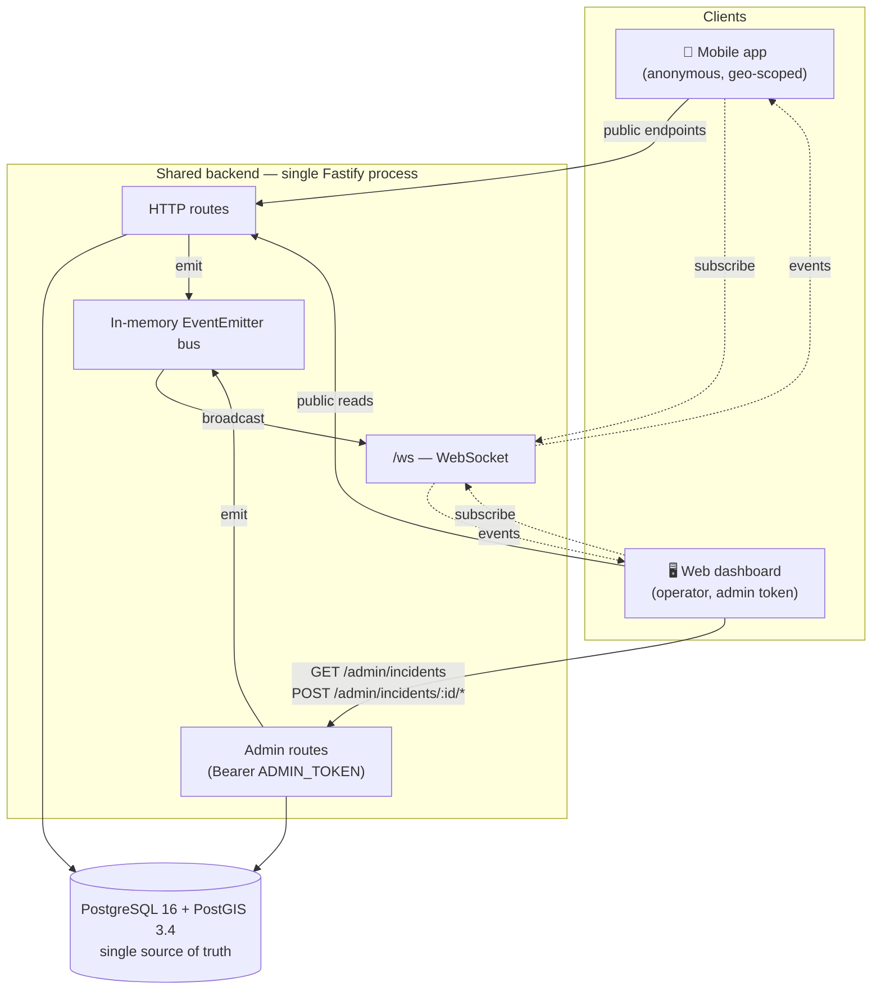
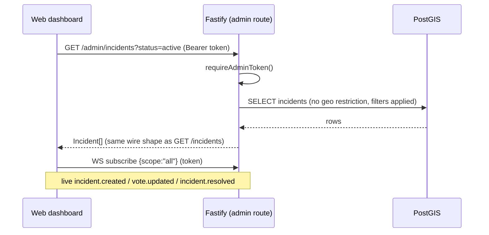

# Balagh Web Dashboard — Backend Specification

> **Core principle:** the web dashboard does **not** get its own backend.
> It is another client of the **same Fastify process** and the **same
> PostgreSQL + PostGIS database** that already serve the mobile app
> (`mobile/backend/`). This document specifies only the **small, additive,
> admin-scoped capabilities** the dashboard needs on top of what already
> exists — nothing more.

**Shared stack (unchanged):** Fastify 5 · PostgreSQL 16 + PostGIS 3.4 ·
Drizzle ORM · Zod · WebSocket (in-memory bus). No Redis. No queue. No second
database. One process, one DB, two client types (mobile app + web dashboard).

---

## Table of Contents

1. [Shared-Backend Principle](#1-shared-backend-principle)
2. [Web Dashboard Analysis](#2-web-dashboard-analysis)
3. [Architecture Overview](#3-architecture-overview)
4. [Reuse vs. Add — Gap Analysis](#4-reuse-vs-add--gap-analysis)
5. [Technology Stack](#5-technology-stack)
6. [Data Model](#6-data-model)
7. [API Design (additive, admin-scoped)](#7-api-design-additive-admin-scoped)
8. [Realtime](#8-realtime)
9. [Security & Privacy](#9-security--privacy)
10. [Deferred Surfaces → Future Modules](#10-deferred-surfaces--future-modules)
11. [Development Phases & AI Prompts](#11-development-phases--ai-prompts)
12. [Final Recommendation](#12-final-recommendation)

---

## 1. Shared-Backend Principle

The mobile app and the web dashboard observe the **same incidents, votes,
comments, and localities**. Splitting them across two backends would mean two
copies of the geo logic, two connection pools to the same tables, and a
constant risk of drift. So:

- **One backend process** (`mobile/backend/`, Fastify) serves both clients.
- **One database** (PostgreSQL + PostGIS) is the single source of truth.
- The mobile app uses the **public, geo-scoped, anonymous** endpoints.
- The web dashboard uses those **same read endpoints** plus a thin layer of
  **admin-scoped** endpoints (token-gated) for the operator's global view and
  moderation actions.

Everything the dashboard's one shipping surface needs is either **already
implemented** or is a **single additive endpoint** (`GET /admin/incidents`)
plus an **admin WebSocket scope**. The remaining dashboard surfaces are
deferred stubs (§10) and require no backend work today.

> Naming note: the backend currently lives under `mobile/backend/`. Because it
> now serves both clients, treat it as the **shared backend**. Renaming the
> directory to `backend/` is optional and out of scope here — the contract is
> what matters, not the path.

---

## 2. Web Dashboard Analysis

The dashboard (`web/frontend/`) is a React + Vite SPA, RTL-first, organized
into three trust tiers. Each surface is either **shipping** (wired to the
backend) or a **deferred stub** ("قيد التطوير").

### Surfaces

| # | Surface | Tier | Status | Backend it consumes |
|---|---|---|---|---|
| 07 | **Live Events Map** (`/console`) | Council | **Shipping** | localities, incidents, status, comments, admin resolve/hide, WS |
| — | **Case Detail** (`/console/case/:id`) | Council | **Shipping** | incident, comments, admin resolve/hide |
| 08 | Mayor's Brief | Council | Deferred | analytics read-model + export |
| 09 | National Dashboard | Coalition | Deferred | analytics aggregation pipeline |
| 10 | Trend Studio | Coalition | Deferred | analytics query engine |
| 11 | Partner Workspace | Coalition | Deferred | NGO messaging |
| 14 | Moderation Console | Operator | Deferred | moderation queue + PII redaction |
| 15 | Abuse Detection | Operator | Deferred | anomaly scoring + policy engine |

### What the shipping surface actually calls

From `web/frontend/src` the dashboard's data layer (`lib/api.ts`, `lib/ws.ts`,
the `features/*` hooks) issues exactly these calls:

| Hook / action | HTTP / WS |
|---|---|
| `useLocalities` | `GET /localities?q=` |
| `useIncidents` | `GET /incidents?lat&lng&radiusKm` *(wants global — see §4)* |
| `useIncident` | `GET /incidents/:id` |
| `useComments` | `GET /incidents/:id/comments` |
| `useStatus` | `GET /status?lat&lng` |
| `useAdminActions('resolve')` | `POST /admin/incidents/:id/resolve` |
| `useAdminActions('hide')` | `POST /admin/incidents/:id/hide` |
| `createWsClient` | `WS /ws` + `{type:'subscribe',lat,lng,radiusKm}` |

> **Frontend alignment note:** `useAdminActions` currently posts to
> `/incidents/:id/:action`. The canonical, token-gated route on the shared
> backend is `/admin/incidents/:id/resolve|hide`. The frontend call path must
> be corrected to the `/admin/...` form when `USE_MOCK=false` is flipped.

### Security constraints (carried over from the dashboard spec — non-negotiable)

- Admin token lives in **`sessionStorage` only** — never `localStorage`, never
  a query string, never logged. Sent as `Authorization: Bearer <token>`.
- **No analytics, no trackers** in the dashboard or added for it.
- **No PII** beyond what the backend already returns. The dashboard must not
  enrich, cross-reference, or export personal data. (The backend stores none:
  it is anonymous by design — `device_id` is a random hex, never a person.)

---

## 3. Architecture Overview

### Component diagram



The **only new backend elements** for the dashboard are drawn inside the
`Admin routes` box: `GET /admin/incidents` (global list) and an admin scope on
`/ws`. Everything else already exists and is reused verbatim.

### Request flow — operator opens the Live Events Map



---

## 4. Reuse vs. Add — Gap Analysis

The shipping surface needs **two** things the mobile-facing API doesn't already
offer. Both are additive and admin-scoped; neither touches the public contract.

| Need | Already exists? | Action |
|---|---|---|
| List localities | ✅ `GET /localities` | Reuse |
| Incident detail | ✅ `GET /incidents/:id` | Reuse |
| Comments | ✅ `GET /incidents/:id/comments` | Reuse |
| Status for a point | ✅ `GET /status` | Reuse |
| Resolve / hide | ✅ `POST /admin/incidents/:id/resolve\|hide` | Reuse (fix FE path) |
| **Global incident list** (all localities, archived tab, filters) | ❌ public list is geo-scoped + active-only | **Add `GET /admin/incidents`** |
| **Country-wide live events** (not a 5 km radius) | ❌ WS subscribe is geo-only | **Add admin WS scope `{scope:"all"}`** |

That is the entire backend scope for the dashboard's shipping functionality:
**one endpoint and one WS subscription mode.** No new tables, no new infra.

---

## 5. Technology Stack

Identical to the shared backend — **nothing new is introduced**.

| Concern | Choice | Note |
|---|---|---|
| Runtime | Node.js 22 | same |
| Framework | Fastify 5 | same process |
| DB | PostgreSQL 16 + PostGIS 3.4 | same DB |
| ORM | Drizzle (raw SQL for geo) | same |
| Validation | Zod | same |
| Realtime | `@fastify/websocket` + in-memory bus | same |
| Rate limit | `@fastify/rate-limit` (in-memory) | same |
| CORS | `@fastify/cors` | **widen origin to the dashboard URL** (only config change) |

### Explicitly NOT adding (and why)

| Rejected | Why it's unnecessary |
|---|---|
| A separate web/BFF service | Dashboard talks to the same Fastify directly; a BFF would duplicate auth + geo logic |
| A second database / read replica | One DB is the source of truth; the admin list is a cheap indexed query |
| GraphQL gateway | REST endpoints already map 1:1 to the dashboard's hooks |
| Analytics warehouse / OLAP | Deferred surfaces only; not built until those ship (§10) |
| Session/cookie auth, user accounts | Operator auth is a single Bearer token, matching the existing admin model |
| Redis / pub-sub broker | Single instance; in-memory bus already fans out to both client types |

---

## 6. Data Model

**No schema changes are required for the shipping surface.** The dashboard reads
the same seven tables the mobile backend already defines:

`localities` · `incidents` · `votes` · `comments` · `devices` ·
`notifications` · `follow_ups`

The new `GET /admin/incidents` query reads `incidents` (optionally joined to
`localities` for names) using the **existing** indexes:

- `idx_incidents_created` — supports newest-first ordering and time filters.
- The PostGIS GiST index on `incidents.geom` — supports the optional bounding-box
  filter (`ST_MakeEnvelope` + `&&`).

If global, status-filtered listing becomes hot, add one composite index — but
only when measured:

```sql
-- Optional, add only if EXPLAIN shows it's needed:
CREATE INDEX idx_incidents_admin_list
  ON incidents (hidden, resolved_at, created_at DESC);
```

Future deferred modules (§10) introduce their own tables when built; they are
**not** part of this spec.

---

## 7. API Design (additive, admin-scoped)

All admin routes require `Authorization: Bearer <ADMIN_TOKEN>` and reuse the
existing `requireAdminToken()` helper and `{code,message}` error envelope.

### 7.1 `GET /admin/incidents` — the one new endpoint

Global, filterable incident list for the operator console. Unlike the public
`GET /incidents`, **geo is optional** and **archived/hidden rows can be
requested**.

**Query parameters** (all optional):

| Param | Type | Default | Notes |
|---|---|---|---|
| `status` | `active` \| `resolved` \| `hidden` \| `all` | `active` | `active` = not hidden, not resolved |
| `severity` | `critical` \| `high` \| `medium` \| `low` | — | repeatable / CSV |
| `localityId` | string | — | filter to one city |
| `category` | Category | — | repeatable / CSV |
| `bbox` | `minLng,minLat,maxLng,maxLat` | — | optional map-viewport filter via PostGIS |
| `since` | ISO 8601 | — | `created_at >=` |
| `limit` | int 1–200 | `100` | page size |
| `cursor` | opaque string | — | keyset pagination on `(created_at,id)` |

**Validation:** Zod schema; reject unknown `status`/`severity` with
`400 VALIDATION_ERROR`. `bbox` must be four finite numbers, `minLng<maxLng`.

**Response 200:** `{ items: Incident[], nextCursor: string | null }`

`Incident` is the **exact same wire type** as `GET /incidents` (so the existing
`Incident` contract and the frontend's TanStack Query caches are unchanged).
`myVote` is `null` for the dashboard (operator is not a voting device).

```bash
curl -H "Authorization: Bearer $ADMIN_TOKEN" \
  "http://localhost:3000/admin/incidents?status=all&severity=critical&limit=50"
```

```json
{
  "items": [
    {
      "id": "uuid", "ref": "BLG-2S0000", "category": "ASSAULT",
      "severity": "high", "lat": 32.51, "lng": 35.15,
      "localityId": "umm-al-fahm", "createdAt": "2024-06-01T10:00:00.000Z",
      "resolvedAt": null, "confirmations": 3, "denials": 0,
      "commentCount": 1, "myVote": null
    }
  ],
  "nextCursor": null
}
```

**Errors:** `401 UNAUTHORIZED` (bad token) · `400 VALIDATION_ERROR` (bad filter).

### 7.2 Reused endpoints (no change)

The dashboard consumes these exactly as the mobile app does:

| Endpoint | Purpose |
|---|---|
| `GET /localities?q=` | city picker |
| `GET /incidents/:id` | case detail |
| `GET /incidents/:id/comments` | case comments |
| `GET /status?lat&lng` | safety badge for a selected locality |
| `POST /admin/incidents/:id/resolve` | resolve (token) |
| `POST /admin/incidents/:id/hide` | hide (token) |
| `GET /health` | liveness |

> The public `GET /incidents?lat&lng&radiusKm` remains for the mobile app. The
> dashboard's global view uses `GET /admin/incidents` instead, but may still
> call the public one when the operator picks a specific locality + radius.

### 7.3 Error envelope (unchanged)

```json
{ "code": "UNAUTHORIZED", "message": "Invalid admin token" }
```

| HTTP | Code | Cause |
|---|---|---|
| 400 | `VALIDATION_ERROR` | bad query parameter |
| 401 | `UNAUTHORIZED` | missing/wrong `ADMIN_TOKEN` |
| 404 | `NOT_FOUND` | incident id not found (resolve/hide) |
| 429 | `RATE_LIMITED` | per-IP limit |
| 500 | `INTERNAL_ERROR` | unexpected |

### 7.4 Contract traceability matrix

Every dashboard data need maps to exactly one endpoint or WS event:

| Dashboard need | Endpoint / event | New? |
|---|---|---|
| City picker | `GET /localities` | no |
| Global incident list + archived tab + filters | `GET /admin/incidents` | **yes** |
| Locality-scoped list (operator picks a city) | `GET /incidents` | no |
| Case detail | `GET /incidents/:id` | no |
| Case comments | `GET /incidents/:id/comments` | no |
| Safety badge | `GET /status` | no |
| Resolve | `POST /admin/incidents/:id/resolve` | no |
| Hide | `POST /admin/incidents/:id/hide` | no |
| Live country-wide updates | `WS /ws` + `{scope:"all"}` | **yes (scope)** |
| Live locality updates | `WS /ws` + `{lat,lng,radiusKm}` | no |

---

## 8. Realtime

The dashboard reuses the existing `/ws` endpoint and in-memory bus. The mobile
client subscribes with a geo frame; the operator console wants **all** events
country-wide. Add one admin subscription mode.

### Admin subscription frame (additive)

```json
{ "type": "subscribe", "scope": "all" }
```

- Accepted **only** when the socket presents a valid admin token. Pass the token
  at connect time as a query param the server validates, e.g.
  `wss://api.example.com/ws?token=<ADMIN_TOKEN>`, **or** as the first frame
  `{ "type": "auth", "token": "<ADMIN_TOKEN>" }`. (Prefer the frame form so the
  token never lands in server access logs / URLs.)
- A socket with `scope:"all"` bypasses the per-socket radius filter in
  `broadcastGeo` and receives every `incident.created`, `incident.resolved`,
  and `vote.updated` event.
- Non-admin sockets that send `scope:"all"` are rejected with a close frame;
  they may only use the existing geo `{lat,lng,radiusKm}` form.

The broadcast function signature is unchanged — admin sockets are simply marked
"match everything" in the subscription registry. `notification.new` remains
device-targeted and is irrelevant to the operator view.

### Keepalive & scale-up

Unchanged: 30 s ping, 90 s idle close. When the backend goes multi-instance,
swap the in-memory bus for Redis pub/sub — admin sockets behave identically.

---

## 9. Security & Privacy

| Concern | Rule |
|---|---|
| Operator auth | Single `Authorization: Bearer <ADMIN_TOKEN>` (same secret as mobile admin). Token in dashboard **`sessionStorage` only**. |
| WS auth | Admin scope requires the token via an `auth` frame; never in the URL where it could be logged. |
| CORS | `@fastify/cors` origin widened to the dashboard's deployed origin(s) only — not `*` in production. |
| PII | None to protect — backend is anonymous (`device_id` is random hex). Dashboard must not enrich/export. |
| Analytics | None added. No trackers in the dashboard or backend. |
| Rate limiting | Existing in-memory per-IP limits apply to admin routes too. |
| Audit log | **Deferred.** When operator accountability is needed, add an append-only `admin_actions` table (who/what/when) — documented, not built now. |

> Today `ADMIN_TOKEN` is a single shared secret. Per-operator identities, roles
> (council vs. coalition vs. operator tiers), and audit trails are a future
> hardening step (§10), not part of the shipping scope.

---

## 10. Deferred Surfaces → Future Modules

These dashboard surfaces render "under development" stubs. Each maps to a future
**additive module on the same backend and DB** — none is built now. Listed so
the architecture has a clear, minimal growth path.

| Surface | Future module | New tables (when built) | New endpoints (sketch) |
|---|---|---|---|
| 08 Mayor's Brief | Analytics read-model + export | none (reads `incidents`) | `GET /admin/analytics/summary?localityId&period`; `GET /admin/export?...` |
| 09 National Dashboard | Aggregation pipeline | optional `metrics_daily` rollup | `GET /admin/analytics/national?period` |
| 10 Trend Studio | Query builder over aggregates | `metrics_daily` | `POST /admin/analytics/query` |
| 11 Partner Workspace | NGO messaging | `partners`, `threads`, `messages` | `GET/POST /admin/threads...` |
| 14 Moderation Console | Moderation queue + PII redaction | `moderation_queue`, `audit_log` | `GET /admin/moderation/queue`; `POST /admin/moderation/:id/{approve,reject}` |
| 15 Abuse Detection | Velocity/anomaly scoring + policy | `threat_scores`, `policies` | `GET /admin/abuse/threats`; dual-approval policy routes |

**Build rule for all of the above:** additive only — new module folder under
`src/modules/`, new migration, new admin-token-gated routes. The public mobile
contract and the existing tables stay untouched. Each should also introduce
per-operator auth + the `audit_log` table before exposing destructive actions.

---

## 11. Development Phases & AI Prompts

Two small phases cover the entire shipping scope. A third (CORS/deploy) is config.
Deferred modules (§10) are intentionally **not** phased here.

### Shared Context Block (prepend to every prompt)

```
You are extending the SHARED Balagh backend at `mobile/backend/` — the single
Fastify 5 + PostgreSQL 16/PostGIS 3.4 + Drizzle + Zod process that serves BOTH
the mobile app and the web dashboard. Do NOT create a new service or database.

Rules:
- Reuse existing helpers: requireAdminToken() (src/modules/admin/routes.ts),
  the {code,message} error envelope (src/lib/errors.ts), the Drizzle client
  (src/db/client.ts), wire types (src/lib/contracts.ts), and the in-memory bus
  (src/lib/events.ts).
- The Incident wire shape returned to the dashboard MUST be byte-for-byte the
  same as GET /incidents (so the frontend's TanStack Query caches and the
  `Incident` type are unchanged). Set myVote: null for admin responses.
- Geo queries use raw pool.query() with ST_DWithin / ST_MakeEnvelope, never an
  ORM geo wrapper. Plain selects use Drizzle.
- Validate all input with Zod; reject bad input as 400 VALIDATION_ERROR.
- Admin routes require Authorization: Bearer <ADMIN_TOKEN>.
- No new dependencies, no Redis, no second DB. Keep it minimal.
- Add unit tests under test/unit/ mirroring the existing style (DB mocked).
```

### Phase WP1 — Global admin incidents list

```
Implement `GET /admin/incidents` in a new file
src/modules/admin/incidents.routes.ts (register it in src/server.ts).

Requirements:
- Bearer admin token (reuse requireAdminToken; refactor it into a shared
  src/modules/admin/auth.ts if convenient, keeping the existing resolve/hide
  routes working).
- Zod-validated query: status (active|resolved|hidden|all, default active),
  severity (CSV → string[]), category (CSV), localityId, bbox
  (minLng,minLat,maxLng,maxLat), since (ISO), limit (1–200, default 100),
  cursor (keyset on created_at,id).
- SQL: build a WHERE clause from the filters.
    * status=active   → hidden=false AND resolved_at IS NULL
    * status=resolved → resolved_at IS NOT NULL
    * status=hidden   → hidden=true
    * status=all      → no status predicate
    * bbox            → geom && ST_MakeEnvelope(minLng,minLat,maxLng,maxLat,4326)
  Order by created_at DESC, id DESC. Use keyset pagination for cursor.
- Map rows to the Incident wire type (myVote: null). Return
  { items: Incident[], nextCursor: string | null }.
- Tests (test/unit/admin-incidents.test.ts): status mapping, severity CSV
  parsing, bbox validation errors, cursor round-trip. Mock src/db/client.

Then update the web frontend:
- Fix useAdminActions to POST /admin/incidents/:id/{resolve,hide}.
- Add a getAdminIncidents() call in web/frontend/src/lib/api.ts (Bearer token)
  and switch the Console's global list (USE_MOCK=false path) to it, keeping the
  mock path unchanged.
```

### Phase WP2 — Admin (global) WebSocket scope

```
Extend src/realtime/ws.ts so a socket can subscribe to ALL events:
- Support an auth frame { type:"auth", token } validated against ADMIN_TOKEN.
- Support { type:"subscribe", scope:"all" } — allowed ONLY for an
  authenticated admin socket; mark it "match everything" in the subscription
  registry so broadcastGeo delivers every geo event regardless of radius.
- Reject scope:"all" from non-admin sockets with a close frame; the geo
  {lat,lng,radiusKm} subscribe path is unchanged for mobile clients.
- Keep notification.new device-targeted (admin sockets don't receive others').
- Tests: admin socket receives an out-of-radius incident.created; non-admin
  socket with scope:"all" is rejected; geo subscribers still filtered.

Then in the web frontend, send the auth frame + {scope:"all"} from
createWsClient when an admin token is present, instead of a geo frame.
```

### Phase WP3 — CORS & deploy config (no code logic)

```
- Widen @fastify/cors origin to include the dashboard's deployed origin(s),
  driven by an env var (e.g. DASHBOARD_ORIGIN, CSV). Keep credentials off;
  the dashboard uses a Bearer token, not cookies. Do not use "*" in production.
- Document the dashboard's required env in web/frontend: VITE_USE_MOCK=false,
  VITE_API_BASE_URL, VITE_WS_URL.
- No new infra: the dashboard is a static SPA (already deployed to GitHub
  Pages) talking to the shared backend over HTTPS/WSS.
```

### Deferred (NOT in scope) — analytics, moderation, abuse, partners

Build only when those surfaces are scheduled, each as an additive module per
§10 (new folder, new migration, admin-gated routes, per-operator auth +
audit_log before any destructive action). Do not pre-build them.

---

## 12. Final Recommendation

**Build:** one endpoint (`GET /admin/incidents`) + one WebSocket scope
(`{scope:"all"}` for authenticated admin sockets) + a CORS origin widening.
That is the complete backend scope to make the dashboard's shipping surface
fully live against real data.

**Do not build:** a separate web backend, a second database, a BFF, GraphQL, an
analytics warehouse, or per-operator auth — until the deferred surfaces (§10)
are actually scheduled.

**Why this is right:** the mobile and web clients share one anonymous,
privacy-first data set. A single Fastify + PostGIS process already owns that
data and already exposes the public reads and admin actions the dashboard
needs. The dashboard's only genuine gaps — a global (non-geo) list and a
country-wide live feed — are thin, additive, admin-scoped extensions that reuse
every existing helper, index, and the same `Incident` wire contract. Nothing
about the mobile contract changes; flipping the dashboard's `USE_MOCK=false`
requires no UI rework.

**MVP → scale path:** keep the single process until load demands otherwise;
then (1) swap the in-memory bus for Redis pub/sub (admin sockets unchanged),
(2) add the `idx_incidents_admin_list` composite index if `EXPLAIN` calls for
it, and (3) introduce per-operator identities + `audit_log` as the first step
of any deferred module that performs destructive or cross-tenant actions.
