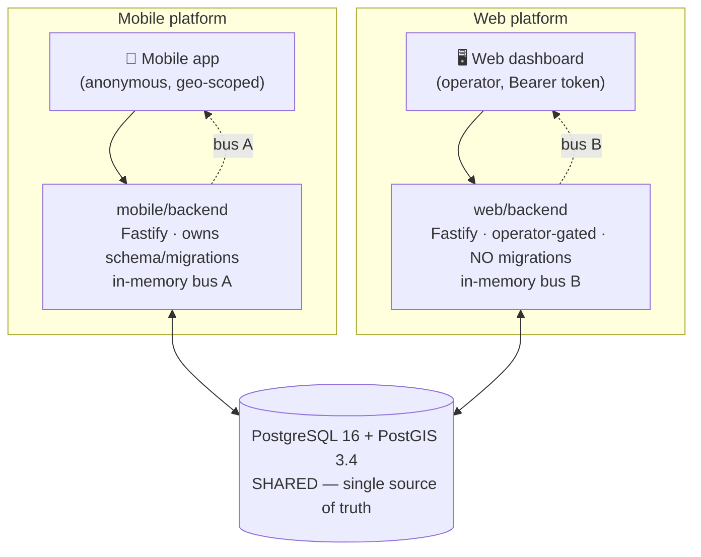
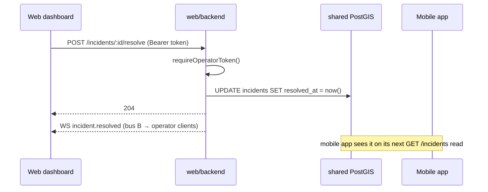

# Balagh Web Dashboard — Backend Specification

> **Core principle:** each platform has its **own backend service**, and the two
> services **share one database**. The mobile app is served by `mobile/backend/`
> (anonymous, public, already built); the web dashboard is served by a **new,
> separate `web/backend/` service** (operator-only). Both connect to the **same
> PostgreSQL + PostGIS database** — the single source of truth. This document
> specifies the web backend and the AI prompts to build it.

**Web backend stack:** Fastify 5 · PostgreSQL 16 + PostGIS 3.4 (shared) ·
Drizzle ORM · Zod · WebSocket (in-memory bus). No Redis. No queue. No second
database. The web backend **never runs migrations** — the mobile backend owns
the schema.

---

## Table of Contents

1. [Two-Backends / Shared-DB Principle](#1-two-backends--shared-db-principle)
2. [Web Dashboard Analysis](#2-web-dashboard-analysis)
3. [Architecture Overview](#3-architecture-overview)
4. [Backend Requirements](#4-backend-requirements)
5. [Technology Stack](#5-technology-stack)
6. [Project Structure](#6-project-structure)
7. [Database Design](#7-database-design)
8. [API Design](#8-api-design)
9. [Realtime](#9-realtime)
10. [Security & Privacy](#10-security--privacy)
11. [Development Phases & AI Prompts](#11-development-phases--ai-prompts)
12. [Final Recommendation](#12-final-recommendation)

---

## 1. Two-Backends / Shared-DB Principle

The mobile app and the web dashboard observe the **same incidents, votes,
comments, and localities**, but they have very different shapes: the mobile app
is anonymous and geo-scoped to one user's surroundings; the dashboard is an
internal operator console that needs a global, moderation-oriented view. Rather
than overload one service with two trust models, each platform gets its **own
backend**, and they **share the database**:

- **`mobile/backend/`** — anonymous, public, geo-scoped endpoints for the app.
  Already built (Fastify + PostGIS + Drizzle). **Owns the schema and migrations.**
- **`web/backend/`** — a **new, separate** Fastify service for the dashboard.
  Fully operator-gated. Reads/writes the shared tables. **Never migrates.**
- **One PostgreSQL + PostGIS database** — the single source of truth both
  services connect to.

Because the database is shared, a resolve/hide performed through the web backend
lands in the same `incidents` table the mobile app reads — so the change is
visible to the mobile app on its next read. The two services do **not** share an
event bus (see §9), which is an intentional, minimal trade-off.

> **Schema ownership:** the mobile backend is the **sole migration runner**. The
> web backend imports a **mirrored copy** of the Drizzle schema and wire
> contracts (kept in sync by hand, the same convention the mobile backend uses
> to mirror the frontend types). It connects to the DB but never creates or
> alters tables.

---

## 2. Web Dashboard Analysis

The dashboard (`web/frontend/`) is a React + Vite SPA, RTL-first, organized into
three trust tiers. Each surface is either **shipping** (wired to the backend) or
a **deferred stub** ("قيد التطوير").

### Surfaces

| # | Surface | Tier | Status | Backend it needs |
|---|---|---|---|---|
| 07 | **Live Events Map** (`/console`) | Council | **Shipping** | localities, incidents, status, comments, resolve/hide, WS |
| — | **Case Detail** (`/console/case/:id`) | Council | **Shipping** | incident, comments, resolve/hide |
| 08 | Mayor's Brief | Council | Deferred | analytics read-model + export |
| 09 | National Dashboard | Coalition | Deferred | analytics aggregation pipeline |
| 10 | Trend Studio | Coalition | Deferred | analytics query engine |
| 11 | Partner Workspace | Coalition | Deferred | NGO messaging |
| 14 | Moderation Console | Operator | Deferred | moderation queue + PII redaction |
| 15 | Abuse Detection | Operator | Deferred | anomaly scoring + policy engine |

### What the shipping surface calls

From `web/frontend/src` the dashboard's data layer (`lib/api.ts`, `lib/ws.ts`,
the `features/*` hooks) issues exactly these calls — all of which the **web
backend** must serve:

| Hook / action | Web-backend call |
|---|---|
| `useLocalities` | `GET /localities?q=` |
| `useIncidents` | `GET /incidents` *(global; optional filters / locality scope)* |
| `useIncident` | `GET /incidents/:id` |
| `useComments` | `GET /incidents/:id/comments` |
| `useStatus` | `GET /status?lat&lng` |
| `useAdminActions('resolve')` | `POST /incidents/:id/resolve` |
| `useAdminActions('hide')` | `POST /incidents/:id/hide` |
| `createWsClient` | `WS /ws` |

The dashboard points `VITE_API_BASE_URL` and `VITE_WS_URL` at **`web/backend`**
(not the mobile backend). Because the web backend is operator-scoped,
resolve/hide live at the bare `/incidents/:id/{resolve,hide}` paths — which is
**exactly what `useAdminActions` already calls** (`api.adminPost('/incidents/${id}/${action}')`).
No frontend path change is needed.

### Security constraints (non-negotiable, carried from the dashboard spec)

- Operator token in **`sessionStorage` only** — never `localStorage`, never a
  query string, never logged. Sent as `Authorization: Bearer <token>`.
- **No analytics, no trackers** in the dashboard or its backend.
- **No PII** beyond what the backend already returns. The dashboard must not
  enrich, cross-reference, or export personal data. (There is none to leak: the
  data is anonymous — `device_id` is random hex, never a person.)

---

## 3. Architecture Overview

### Component diagram



Two Fastify processes, two in-memory buses, **one database**. Each WebSocket
serves only its own clients (§9).

### Request flow — operator resolves an incident



---

## 4. Backend Requirements

### Functional

- Serve the dashboard's shipping surface entirely from the shared DB: list
  localities, list incidents globally (with operator filters), fetch one
  incident, fetch its comments, compute status for a point, resolve and hide.
- Live-update operator clients when an operator performs resolve/hide.
- Every endpoint operator-gated except `GET /health`.

### Non-functional

- Identical wire contracts to the mobile backend (`Incident`, `Comment`,
  `Locality`, `StatusResponse`, `WsEvent`) so the dashboard needs no UI rework
  when `USE_MOCK=false`.
- `GET /incidents` returns a plain `Incident[]` (matches the frontend's
  `api.get<Incident[]>`).
- Reuse the shared DB's existing indexes; no new schema for the shipping surface.
- Single process, no Redis, no queue, no second DB.

### Explicitly not built (now)

Audit logging, per-operator identities/roles, push notifications, analytics, and
all deferred surfaces (§11). Documented as future additive modules.

---

## 5. Technology Stack

Same building blocks as the mobile backend — chosen for consistency, **not** a
new platform.

| Concern | Choice | Note |
|---|---|---|
| Runtime | Node.js 22 | same as mobile |
| Framework | Fastify 5 | separate process from mobile |
| DB | PostgreSQL 16 + PostGIS 3.4 | **shared** with mobile |
| ORM | Drizzle (raw SQL for geo) | mirrored schema, read-mostly |
| Validation | Zod | env + every query/body |
| Realtime | `@fastify/websocket` + in-memory bus | this process only |
| Rate limit | `@fastify/rate-limit` (in-memory) | per-IP |
| CORS | `@fastify/cors` | dashboard origin only |
| Auth | global Bearer-token preHandler | operator-only |

### Explicitly NOT adding (and why)

| Rejected | Why it's unnecessary |
|---|---|
| A second database / read replica | One shared DB is the source of truth; the dashboard's list is a cheap indexed query |
| A BFF / API-gateway layer | The dashboard talks to `web/backend` directly; a BFF would duplicate auth + geo logic |
| GraphQL | REST endpoints map 1:1 to the dashboard's hooks |
| Redis / message broker | Single instance; per-process in-memory bus is enough (§9) |
| Analytics / OLAP warehouse | Deferred surfaces only; not built until they ship |
| Migrations in the web backend | Mobile backend owns the schema; two migrators on one DB invites conflicts |
| Sessions/cookies, user accounts | Operator auth is a single Bearer token |

---

## 6. Project Structure

New service, mirroring the mobile backend's minimal layout. **No `migrate.ts`,
`migrations/`, or `seed.ts`** — those live only in `mobile/backend/`.

```
web/backend/
├── package.json · tsconfig.json · drizzle.config.ts · .env.example · README.md
└── src/
    ├── server.ts          # Fastify bootstrap + global operator-auth hook + WS
    ├── config.ts          # Zod env: DATABASE_URL (shared), OPERATOR_TOKEN,
    │                       #          PORT, DASHBOARD_ORIGIN (CORS), LOG_LEVEL
    ├── lib/
    │   ├── auth.ts         # requireOperatorToken — global preHandler (Bearer)
    │   ├── errors.ts       # mirrored {code,message} envelope + error handler
    │   ├── geo.ts          # mirrored haversineKm (status refinement)
    │   ├── identity.ts     # mirrored deriveEmojis (comment identity tags)
    │   ├── contracts.ts    # mirrored wire types (Incident/Comment/Locality/…)
    │   ├── constants.ts    # mirrored domain constants (radii/windows/threshold)
    │   └── events.ts       # in-memory EventEmitter bus (THIS process only)
    ├── db/
    │   ├── client.ts       # Drizzle + pg Pool → shared DB.  NO migrate/seed.
    │   └── schema.ts       # mirrored Drizzle schema (read-mostly view)
    ├── modules/
    │   ├── localities/routes.ts             # GET /localities?q=
    │   ├── incidents/
    │   │   ├── routes.ts                     # list, detail, comments, resolve, hide
    │   │   └── service.ts                    # geo + filter SQL
    │   └── status/
    │       ├── routes.ts                     # GET /status
    │       └── service.ts                    # calculateStatus() (ported)
    └── realtime/
        └── ws.ts           # operator-scoped /ws over this process's bus
test/
└── unit/                   # geo, identity, status, incident-filter parsing (DB mocked)
```

---

## 7. Database Design

**No schema changes.** The web backend reads the same seven tables the mobile
backend defines and migrates:

`localities` · `incidents` · `votes` · `comments` · `devices` ·
`notifications` · `follow_ups`

The dashboard's reads touch `localities`, `incidents`, and `comments`. Writes
(resolve/hide) update `incidents.resolved_at` / `incidents.hidden`.

Existing indexes already cover the dashboard's queries:

- `idx_incidents_created` — newest-first ordering and `since` filtering.
- PostGIS GiST index on `incidents.geom` — optional `bbox` and locality-radius
  filters via `ST_MakeEnvelope` / `ST_DWithin`.

If global, status-filtered listing becomes hot under real volume, add **one**
composite index — but only when `EXPLAIN` shows it's needed, and add it as a
**migration in `mobile/backend/`** (the schema owner), not here:

```sql
-- Add only if measured; owned by mobile/backend migrations:
CREATE INDEX idx_incidents_admin_list
  ON incidents (hidden, resolved_at, created_at DESC);
```

Geo queries use raw `pool.query()` with `ST_DWithin` / `ST_MakeEnvelope`; plain
selects use Drizzle — identical to the mobile backend's pattern.

---

## 8. API Design

All routes require `Authorization: Bearer <OPERATOR_TOKEN>` via a single global
preHandler, **except `GET /health`**. Errors use the shared `{code,message}`
envelope.

### 8.1 `GET /health`

Liveness — the only ungated route. Runs `SELECT 1`.

```json
{ "ok": true, "db": "ok" }
```

### 8.2 `GET /localities?q=`

Trigram search across Arabic/Hebrew/English names. Empty `q` returns all cities.
Returns `Locality[]`.

### 8.3 `GET /incidents` — global operator list

Unlike the mobile app's geo-scoped, active-only list, this is **global** with
operator filters. **Returns a plain `Incident[]`** to match the dashboard's
existing `api.get<Incident[]>('/incidents?…')` call exactly.

**Query parameters** (all optional):

| Param | Type | Default | Notes |
|---|---|---|---|
| `status` | `active` \| `resolved` \| `hidden` \| `all` | `active` | `active` = not hidden, not resolved |
| `severity` | `critical` \| `high` \| `medium` \| `low` | — | CSV / repeatable |
| `category` | Category | — | CSV / repeatable |
| `localityId` | string | — | filter to one city |
| `bbox` | `minLng,minLat,maxLng,maxLat` | — | map-viewport filter (PostGIS) |
| `since` | ISO 8601 | — | `created_at >=` |
| `lat`,`lng`,`radiusKm` | number | — | optional locality-radius scope (operator picks a city) |

**Status → SQL predicate:**
- `active` → `hidden=false AND resolved_at IS NULL`
- `resolved` → `resolved_at IS NOT NULL`
- `hidden` → `hidden=true`
- `all` → no status predicate

**Validation:** Zod; reject unknown `status`/`severity`/`category` with
`400 VALIDATION_ERROR`; `bbox` must be four finite numbers with `minLng<maxLng`,
`minLat<maxLat`. Order by `created_at DESC, id DESC`. `myVote` is always `null`
(the operator is not a voting device).

```bash
curl -H "Authorization: Bearer $OPERATOR_TOKEN" \
  "http://localhost:4000/incidents?status=all&severity=critical"
```

```json
[
  {
    "id": "uuid", "ref": "BLG-2S0000", "category": "ASSAULT",
    "severity": "high", "lat": 32.51, "lng": 35.15,
    "localityId": "umm-al-fahm", "createdAt": "2024-06-01T10:00:00.000Z",
    "resolvedAt": null, "confirmations": 3, "denials": 0,
    "commentCount": 1, "myVote": null
  }
]
```

> **Pagination:** returning a plain array keeps the dashboard contract unchanged.
> If real volume demands it, evolve to `{ items, nextCursor }` with keyset
> pagination on `(created_at, id)` — a documented future change, not built now.

### 8.4 `GET /incidents/:id`

Single incident (`myVote: null`). `404 NOT_FOUND` if hidden or missing.

### 8.5 `GET /incidents/:id/comments`

`Comment[]`, oldest-first. `identityTag` is the 3-emoji array derived via the
mirrored `deriveEmojis()` — never the raw device id.

### 8.6 `GET /status?lat&lng`

Computes the safety state for a point using the ported `calculateStatus()` and
mirrored constants, so it matches the mobile backend exactly. Returns
`StatusResponse` (`{ state, reason }`). Read-only here — it does **not** upsert
device location (that's the mobile app's concern).

### 8.7 `POST /incidents/:id/resolve` · `POST /incidents/:id/hide`

Resolve sets `resolved_at = now()`; hide sets `hidden = true`. Each emits to
this process's bus (§9). **Response 204.** `404` if not found.

### 8.8 Error envelope

```json
{ "code": "UNAUTHORIZED", "message": "Invalid operator token" }
```

| HTTP | Code | Cause |
|---|---|---|
| 400 | `VALIDATION_ERROR` | bad query/body |
| 401 | `UNAUTHORIZED` | missing/wrong `OPERATOR_TOKEN` |
| 404 | `NOT_FOUND` | incident not found / hidden |
| 429 | `RATE_LIMITED` | per-IP limit |
| 500 | `INTERNAL_ERROR` | unexpected |

### 8.9 Contract traceability matrix

Every dashboard data need maps to exactly one web-backend endpoint / WS event:

| Dashboard hook / need | Web-backend endpoint / event |
|---|---|
| `useLocalities` | `GET /localities` |
| `useIncidents` (global list + archived tab + filters) | `GET /incidents` |
| `useIncident` | `GET /incidents/:id` |
| `useComments` | `GET /incidents/:id/comments` |
| `useStatus` | `GET /status` |
| `useAdminActions('resolve')` | `POST /incidents/:id/resolve` |
| `useAdminActions('hide')` | `POST /incidents/:id/hide` |
| `createWsClient` (operator live feed) | `WS /ws` |

---

## 9. Realtime

The web backend runs its **own** in-memory `EventEmitter` bus (`lib/events.ts`),
serving **only the dashboard's WebSocket clients**. It is **not** connected to
the mobile backend's bus.

### Operator feed

- Connect at `ws://…/ws` (operator token validated at connect, e.g. via an
  `{ type:"auth", token }` frame so the token never lands in URLs/logs).
- `POST /incidents/:id/{resolve,hide}` emits `incident.resolved` (and a
  hide-equivalent) to all connected operators, so a team of operators stays in
  sync live. Frame shapes reuse the shared `WsEvent` type.

### Honest limitation (per-process buses)

**Brand-new field incidents are created in the *mobile* backend's process**, so
they are **not pushed** to the dashboard — the two buses are separate. The
dashboard converges on new incidents via a modest TanStack Query
`refetchInterval` (~15–30 s) on the `GET /incidents` list. The `LiveIndicator`
reflects the operator-feed connection (resolve/hide echoes), not field-incident
push.

### Upgrade path (when live cross-platform push is required)

- **Postgres `LISTEN/NOTIFY`** (no Redis): both backends `NOTIFY` on writes and
  `LISTEN` to re-broadcast over their own WS — true live sync across platforms
  using only the shared DB.
- **Redis pub/sub**: when going multi-instance, swap the in-memory bus for Redis;
  the broadcast signature stays identical.

---

## 10. Security & Privacy

| Concern | Rule |
|---|---|
| Operator auth | Single `Authorization: Bearer <OPERATOR_TOKEN>` on every route except `/health`, via a global preHandler. Token in dashboard **`sessionStorage` only**. |
| WS auth | Token presented in an `auth` frame, never in the URL. |
| CORS | `@fastify/cors` origin restricted to the dashboard's deployed origin(s) via `DASHBOARD_ORIGIN` — never `*` in production. Credentials off (Bearer, not cookies). |
| PII | None to protect — data is anonymous (`device_id` is random hex). Dashboard must not enrich/export. |
| Analytics | None added. No trackers in the dashboard or this backend. |
| Rate limiting | Existing in-memory per-IP limits apply. |
| Audit log | **Deferred.** When operator accountability is needed, add an append-only `admin_actions` table (who/what/when) — coordinated as a mobile-owned migration. |

> Today `OPERATOR_TOKEN` is one shared secret. Per-operator identities and tier
> roles (council / coalition / operator) are a future hardening step (§11), not
> part of the shipping scope.

---

## 11. Development Phases & AI Prompts

Four small phases cover the shipping scope. Deferred surfaces are intentionally
**not** phased here.

### Shared Context Block (prepend to every prompt)

```
Build a NEW, SEPARATE Fastify 5 service at `web/backend/` that serves ONLY the
web dashboard (web/frontend). It connects to the SAME shared PostgreSQL 16 +
PostGIS 3.4 database as the existing `mobile/backend/` service — but it is its
own process. Each platform has its own backend; they share one database.

Rules:
- MIRROR (copy verbatim, with a "keep in sync with mobile/backend" comment) the
  Drizzle schema (src/db/schema.ts), wire types (src/lib/contracts.ts), error
  envelope (src/lib/errors.ts), haversineKm (src/lib/geo.ts), deriveEmojis
  (src/lib/identity.ts), and domain constants (src/lib/constants.ts) from
  mobile/backend/src/...
- The web backend NEVER migrates or seeds. The mobile backend owns the schema.
  db/client.ts only opens a pg Pool + Drizzle to DATABASE_URL.
- EVERY route requires `Authorization: Bearer <OPERATOR_TOKEN>` via a single
  global preHandler, EXCEPT `GET /health`.
- The Incident wire shape MUST be byte-for-byte identical to the mobile backend
  and the frontend `Incident` type. `GET /incidents` returns a plain Incident[]
  (NOT a paginated envelope). Set myVote: null everywhere.
- Geo queries use raw pool.query() with ST_DWithin / ST_MakeEnvelope; plain
  selects use Drizzle.
- Validate all input with Zod; bad input → 400 VALIDATION_ERROR.
- Per-process in-memory EventEmitter bus (src/lib/events.ts) for the operator
  WebSocket. Do NOT connect to the mobile backend's bus. No Redis, no queue,
  no second DB, no new heavy deps.
- Use a distinct PORT (e.g. 4000) so it can run alongside mobile/backend (3000).
```

### Phase WP1 — Scaffold + auth + localities

```
Create web/backend/ with package.json, tsconfig.json, drizzle.config.ts,
.env.example, README.md (mirror mobile/backend's tooling).

- src/config.ts: Zod-validated env — DATABASE_URL, OPERATOR_TOKEN, PORT
  (default 4000), DASHBOARD_ORIGIN (CSV for CORS), LOG_LEVEL.
- src/db/client.ts: pg Pool + Drizzle to DATABASE_URL (timestamps as ISO
  strings). No migrate/seed.
- Mirror src/lib/{errors,geo,identity,contracts,constants}.ts and
  src/db/schema.ts from mobile/backend.
- src/lib/auth.ts: requireOperatorToken — a global Fastify preHandler that
  enforces Bearer OPERATOR_TOKEN on all routes except GET /health (throws
  401 UNAUTHORIZED via the shared error envelope).
- src/server.ts: Fastify bootstrap — register @fastify/cors (origin =
  DASHBOARD_ORIGIN), @fastify/rate-limit, @fastify/websocket, the global auth
  hook, the error handler, GET /health (SELECT 1), and the localities route.
- src/modules/localities/routes.ts: GET /localities?q= (trigram ILIKE across
  name_ar/name_he/name_en), returns Locality[].
- Tests: identity.test.ts + geo.test.ts ported from mobile/backend.
```

### Phase WP2 — Incidents + status

```
- src/modules/incidents/service.ts + routes.ts:
    * GET /incidents — Zod-parse filters (status default active; severity/
      category CSV; localityId; bbox; since; optional lat/lng/radiusKm). Build
      WHERE from §8.3. Order created_at DESC, id DESC. Return plain Incident[]
      (myVote: null).
    * GET /incidents/:id — single Incident, 404 if hidden/missing.
    * GET /incidents/:id/comments — Comment[] oldest-first, identityTag via
      deriveEmojis.
    * POST /incidents/:id/resolve — set resolved_at=now(); emit incident.resolved
      to the bus; 204.
    * POST /incidents/:id/hide — set hidden=true; emit hide event; 204.
- src/modules/status/{service,routes.ts}: port calculateStatus() + constants;
  GET /status?lat&lng → StatusResponse (read-only, no device upsert).
- Register all in server.ts.
- Tests (DB mocked): status calm/watch/active scenarios; incident-filter
  parsing (status mapping, severity CSV, bbox validation errors).
```

### Phase WP3 — Operator realtime

```
- src/realtime/ws.ts: /ws handler. Validate OPERATOR_TOKEN via an
  { type:"auth", token } frame (reject unauthenticated sockets). Subscribe each
  socket to the in-memory bus and forward incident.resolved / hide events to all
  operators. 30s ping / 90s idle close.
- Wire incidents resolve/hide to emit through the bus (already added in WP2).
- Document in the README the per-process limitation: NEW field incidents are
  created in mobile/backend and are NOT pushed here; the dashboard refetches.
```

### Phase WP4 — Frontend wiring

```
In web/frontend:
- Set VITE_USE_MOCK=false, VITE_API_BASE_URL and VITE_WS_URL to the web backend.
- Add a modest refetchInterval (~15-30s) to the incidents list query so new
  field incidents appear without a live push.
- Confirm useAdminActions already posts to /incidents/:id/{resolve,hide}
  (it does) — no path change needed.
- Verify the LiveIndicator reflects the operator WS connection.
```

### Deferred (NOT in scope)

Mayor's Brief (08), National Dashboard (09), Trend Studio (10), Partner
Workspace (11), Moderation Console (14), Abuse Detection (15) — each a future
additive module under `web/backend/src/modules/`, reading the shared DB or
adding its own **mobile-coordinated** migration, and introducing per-operator
auth + an `admin_actions` audit log before any destructive action. Do not
pre-build them.

---

## 12. Final Recommendation

**Build** a new, separate `web/backend/` Fastify service that connects to the
**shared** PostgreSQL + PostGIS database: a global operator-gated incidents API
(`GET /incidents`, detail, comments, status, resolve, hide), a localities
search, and an operator WebSocket — every route behind one Bearer token. Mirror
the schema/contracts/geo/identity/constants from the mobile backend; **never**
migrate from here.

**Do not build** a second database, a BFF, GraphQL, Redis, an analytics
warehouse, or per-operator auth — until the deferred surfaces are actually
scheduled.

**Why this is right:** the two platforms have genuinely different trust models
(anonymous app vs. operator console), so each owning its backend keeps both
simple — while a single shared database guarantees they see the same truth and
prevents data drift. The dashboard's contracts are identical to the mobile
backend's, so flipping `USE_MOCK=false` and pointing at `web/backend` requires
no UI rework.

**MVP → scale path:** keep two single-process services on one DB until load
demands otherwise; then (1) adopt Postgres `LISTEN/NOTIFY` for true live
cross-platform push, (2) swap each in-memory bus for Redis pub/sub when going
multi-instance, (3) add `idx_incidents_admin_list` if `EXPLAIN` calls for it,
and (4) introduce per-operator identities + an `admin_actions` audit log as the
first step of any deferred module that performs destructive actions.
