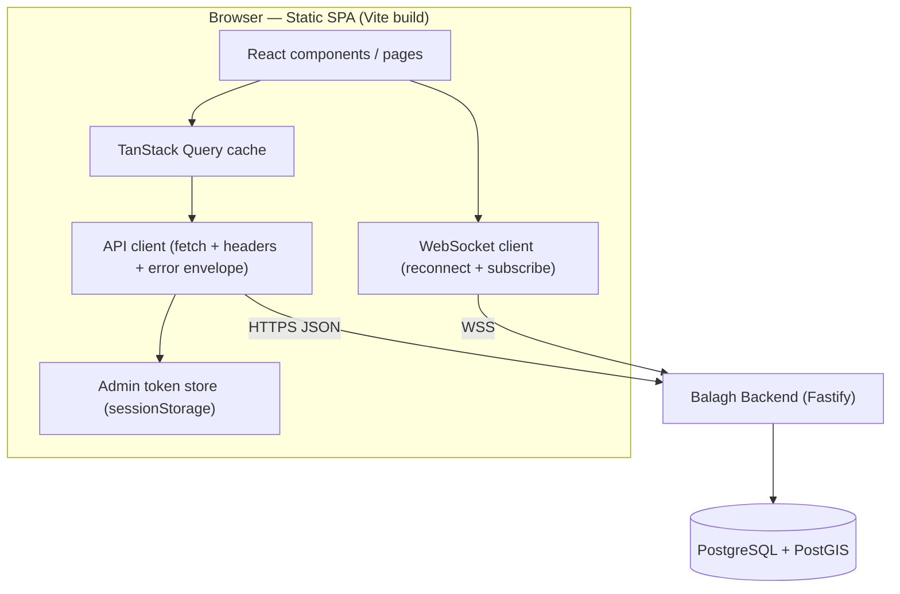

# Balagh Web Dashboard — UI/UX & Architecture Specification

> **Stack in one line:** Vite · React 18 · TypeScript · Tailwind CSS · TanStack Query · MapLibre GL · native WebSocket — a single static SPA, no SSR, no backend of its own.

> **Scope principle:** This document separates the **long-term Product Vision** (§3, the full three-tier dashboard ecosystem) from the **buildable MVP** (§4 onward). The MVP specs, AI prompts, and phases describe **only what the current Balagh backend can serve today**. Every other surface in the vision is tagged `DEFERRED — needs backend` and is intentionally not built yet, to avoid shipping UI that has no real data behind it.

---

## Table of Contents

1. [Overview](#1-overview)
2. [Backend Contract (what exists today)](#2-backend-contract-what-exists-today)
3. [Product Vision — Full Three-Tier Dashboard](#3-product-vision--full-three-tier-dashboard)
4. [MVP Scope vs. Backend Readiness](#4-mvp-scope-vs-backend-readiness)
5. [Architecture Overview](#5-architecture-overview)
6. [Technology Stack](#6-technology-stack)
7. [Project Structure](#7-project-structure)
8. [Design System](#8-design-system)
9. [MVP Surface Specifications](#9-mvp-surface-specifications)
10. [State & Data Layer](#10-state--data-layer)
11. [Security & Privacy](#11-security--privacy)
12. [Development Phases & AI Prompts](#12-development-phases--ai-prompts)
13. [QA & Acceptance Criteria](#13-qa--acceptance-criteria)
14. [Appendix A — Arabic UI Terminology Map](#appendix-a--arabic-ui-terminology-map)
15. [Appendix B — Deferred Backlog](#appendix-b--deferred-backlog)

---

## 1. Overview

### 1.1 What this is

The Balagh Web Dashboard is the operator-facing companion to the Balagh mobile app. Where the mobile app is the **anonymous citizen reporting** surface, the web dashboard is the **operations surface**: a desktop-first (mobile-responsive) console for viewing reported incidents on a live map, triaging them, inspecting detail and community confirmations, and closing them out (resolve / hide).

### 1.2 The honest scope boundary

The full product vision (§3) describes three role tiers — Municipal Coordinator, NGO Research Analyst, and Platform Security Operator — with moderation, analytics, abuse detection, RBAC, and audit logging. **None of those subsystems exist in the backend yet.** The backend today exposes anonymous incident endpoints plus two token-protected admin actions (`resolve`, `hide`). See [BackendSpecs.md §7](../mobile/backend/BackendSpecs.md).

Therefore this spec builds **one console** — effectively the buildable slice of the *Council-Private* tier — and defers the rest. This mirrors the discipline already used on the backend (minimal, no speculative infra) and on mobile (mock-first, flip one flag to go live).

### 1.3 Design goals

| Goal | How |
| :--- | :--- |
| **Minimalist** | One SPA, one build, no SSR, no state-management library beyond TanStack Query + a tiny token store. |
| **Contract-faithful** | `src/lib/contracts.ts` mirrors the backend wire types 1:1 (same file content as the mobile app's `core/types`). |
| **Mock-first** | Build every surface against an in-memory mock that speaks the exact backend shape; flip `VITE_USE_MOCK=false` to hit the real API — no UI changes. |
| **RTL-native** | Arabic is the primary UI language; the app is `dir="rtl"` by default with logical CSS properties throughout. |
| **No scope creep** | Anything not backed by a real endpoint is a `DEFERRED` placeholder, visibly stubbed, never faked as working. |

---

## 2. Backend Contract (what exists today)

The dashboard consumes the exact API defined in [BackendSpecs.md §7](../mobile/backend/BackendSpecs.md). Endpoints the dashboard actually uses:

### 2.1 Endpoints consumed

| Method & Path | Auth header | Used by surface |
| :--- | :--- | :--- |
| `GET /health` | — | Connection status chip |
| `GET /localities?q=` | — | Locality picker (set map center) |
| `GET /incidents?lat=&lng=&radiusKm=` | `X-Device-Id` | Live Map + Case list |
| `GET /incidents/:id` | `X-Device-Id` | Incident detail drawer |
| `GET /incidents/:id/comments` | — | Detail drawer comments |
| `GET /status?lat=&lng=` | `X-Device-Id` | Area status badge |
| `POST /admin/incidents/:id/resolve` | `Authorization: Bearer <ADMIN_TOKEN>` | "Resolve & close" action |
| `POST /admin/incidents/:id/hide` | `Authorization: Bearer <ADMIN_TOKEN>` | "Hide" moderation action |
| `WS /ws?deviceId=` | (query / `X-Device-Id`) | Live feed |

> The dashboard is **read + moderate** only. It deliberately does **not** call `POST /incidents`, `/vote`, `/comments`, `/follow-up`, or `/notifications/*` — those are citizen actions owned by the mobile app.

### 2.2 Wire types (mirrored verbatim)

`src/lib/contracts.ts` is a byte-for-byte copy of `mobile/frontend/Balagh/src/core/types/index.ts`:

```ts
export type Severity = 'critical' | 'high' | 'medium' | 'low';
export type Category = 'GUNFIRE' | 'STABBING' | 'ASSAULT' | 'ROBBERY' | 'SUSPICIOUS' | 'OTHER';
export type SafetyState = 'calm' | 'watch' | 'active';

export interface Locality { id: string; nameAr: string; nameHe: string; nameEn: string; lat: number; lng: number; }
export interface Incident {
  id: string; ref: string; category: Category; severity: Severity; description?: string;
  lat: number; lng: number; localityId: string; createdAt: string; resolvedAt?: string;
  confirmations: number; denials: number; commentCount: number; myVote?: 'confirm' | 'deny' | null;
}
export interface Comment { id: string; incidentId: string; identityTag: [string, string, string]; body: string; createdAt: string; }
export interface StatusResponse { state: SafetyState; reason: string; }

export type WsEvent =
  | { t: 'incident.created'; incident: Incident }
  | { t: 'incident.resolved'; id: string }
  | { t: 'status.changed'; state: SafetyState; reason: string }
  | { t: 'vote.updated'; id: string; confirmations: number; denials: number }
  | { t: 'notification.new'; notification: AppNotification };

export interface ApiError { code: string; message: string; }
```

### 2.3 Cross-cutting backend rules the dashboard must honor

- **Error envelope:** every non-2xx returns `{ code, message }`. The API client surfaces `message` and branches on `code`.
- **426 Update Gate:** if the client sends `X-App-Version` below `MIN_APP_VERSION`, the server returns `426 UPDATE_REQUIRED`. The dashboard sends its `version.ts` value and shows a full-screen "update required" wall on 426.
- **Rate limits:** admin actions are not separately limited but share the global 100/min/IP bucket; the client shows the `RATE_LIMITED` message on 429.
- **`X-Device-Id`:** read endpoints require it. The dashboard generates a stable synthetic id (`dashboard-<uuid>`, persisted in `localStorage`) — it is not a citizen device and submits nothing.

---

## 3. Product Vision — Full Three-Tier Dashboard

> **Status:** This section is the *aspirational* product specification. It is preserved and refined here as the north star. Each surface carries a **readiness tag**. Only `BUILDABLE NOW` items enter the MVP (§4+). This is an improved, de-duplicated, RTL-consistent rewrite of the original UI brief.

The Balagh Web Dashboard ecosystem is the administrative, analytical, and security-monitoring tier of the platform. Access is governed by **role-based access control (RBAC) at the API level**. To prevent operational errors and accidental data leaks, the interface uses a strict **three-tier visual language** so an operator always knows which trust boundary they are inside.

### 3.1 System-wide visual & role strategy

| Tier | Accent (sidebar/header) | Primary role | Key focus | Readiness |
| :--- | :--- | :--- | :--- | :--- |
| **Council-Private** | Crimson `#A83231` | Municipal Coordinator | Local dispatch, triage & case closure | ⚙️ **Partial — buildable slice = MVP** |
| **Coalition-Internal** | Olive `#5A6E3F` | NGO Research Analyst | Aggregated trend analysis & advocacy | 🔒 **DEFERRED — needs analytics backend** |
| **Operator-Only** | Forest `#1F2818` | Platform Security Operator | Moderation, PII sanitization, anti-abuse | 🔒 **DEFERRED — needs moderation/abuse backend** |

**Viewport targets**

- **Desktop (≥ 1280px):** high-density multi-column layouts, interactive MapLibre canvas, side-by-side tables, physical keyboard shortcuts.
- **Mobile (360–480px):** bottom navigation, sliding bottom-sheets, swipe-to-action cards, landscape prompts for dense charts.

### 3.2 Council-Private Tier — Municipal Coordinator

Localized emergency response and dispatch within municipal boundaries.

#### Surface 04 — Local Live Map (خارطة الأحداث الحية) · ⚙️ Partial (map + triage = MVP; dispatch deferred)

- **Objective:** real-time localized incident mapping, intake triage, responder dispatch.
- **Desktop:**
  - **Top header stream:** crimson pulsing live indicator **بث حي** (Live Feed) + a 4-stat strip of critical counts. → *Live indicator is **BUILDABLE NOW** via WebSocket; stat strip is buildable from the incidents list.*
  - **Left triage rail (قائمة الفرز الميداني):** chronological feed of active events, each with priority badge + **غير معين** (Unassigned) label. → *List is **BUILDABLE NOW**; the "assigned/unassigned" state is **DEFERRED** (no assignment field in backend).*
  - **Center canvas:** MapLibre vector map of local boundaries with pulsing pins on incidents. → ***BUILDABLE NOW.***
  - **Right context panel (تفاصيل الحدث والرد السريع):** report details + cryptographic source validation + an orange **مرفق حساس في الجوار** (Sensitive Facility Nearby) warning when a violent incident is within 200m of a shelter. → *Details are **BUILDABLE NOW**; source-signature validation and facility proximity are **DEFERRED** (no signature/facility data).*
  - **Recommended responders module / تعيين (Assign):** → **DEFERRED** (no responder model).
- **Mobile:** full-screen map, floating **بث حي نشط** badge, bottom-sheet incident list; tapping an incident recenters the map.

#### Surface 07 — Case Workspace (مساحة إدارة الحالات) · ⚙️ Partial (list + close = MVP; assignee deferred)

- **Objective:** the system of record for open municipal tasks — monitor, update status, record outcome.
- **Desktop:** high-density matrix (ID · Category · Location · Assignee · Priority · Status). Statuses as color-coded badges: **غير معين** (Unassigned, yellow), **قيد المعالجة** (In-Progress, blue), **مغلق وجرى الحل** (Resolved & Closed, emerald). Selecting a row opens a right slide-out drawer with a mandatory narrative field **تفاصيل الإجراء والنتيجة النهائية**; **حفظ وإغلاق الملف** (Save & Close) updates status.
  - → *Backend supports two terminal transitions only: **resolve** and **hide**. So MVP status reduces to **Active → Resolved/Hidden**. **Assignee**, **In-Progress**, and the **narrative outcome field** are **DEFERRED** (no columns in backend). The drawer's "Resolve & Close" maps to `POST /admin/incidents/:id/resolve`.*
- **Mobile:** active/archived filter tabs, 48px touch targets, swipe-left to act.

#### Surface 08 — Mayor's Brief (موجز رئيس السلطة المحلية) · 🔒 DEFERRED — needs analytics + export backend

Executive summary with PDF/CSV/PPT/Text export, donut charts, response-time velocity, and an opt-in **مقارنة الأداء العام** peer-town comparison. → No aggregation, no export service, no cross-municipality data in backend.

### 3.3 Coalition-Internal Tier — NGO Research Analyst · 🔒 DEFERRED (entire tier)

- **Surface 09 — National Dashboard (لوحة المؤشرات الوطنية):** coverage bar **البلديات المشاركة: ٢٤ / ٣٦**, methodology footnotes **حد الكشف الإحصائي الأدنى: ٣ أحداث**, anomaly desk (z-score ≥ 2.5), **بيانات مؤقتة** badges.
- **Surface 10 — Trend Studio (استوديو دراسة الاتجاهات):** drag-and-drop query builder (Measure × Category × Period × Region), **محفوظ تلقائياً** autosave, multi-chart workspace, full data-bundle export.
- **Surface 11 — Partner Workspace (مساحة عمل الشركاء):** cross-NGO threads, pinned Trend Studio context, client-side **حظر إرسال المعرفات الفردية** identifier filter.

→ Needs an analytics/aggregation pipeline, fuzzed-coordinate boundary, multi-tenant identity, and a messaging system — none of which exist.

### 3.4 Operator-Only Tier — Platform Security Operator · 🔒 DEFERRED (entire tier)

- **Surface 14 — Moderation Console (كونسول مراجعة البلاغات):** intake queue, auto-PII redaction **[تم إخفاء البيانات الشخصية حفاظاً على السرية]**, keyboard-bound actions (**A** approve / **R** reject / **M** merge / **J·K** navigate).
- **Surface 15 — Abuse Detection (لوحة مكافحة إساءة الاستخدام):** **تنبيه نشط** emergency banner, threat-score posture monitor (2σ baseline), threats table, **المصادقة الثنائية** 4-eyes approval for policy changes.

→ Needs a moderation queue, PII detection, threat-scoring, and 4-eyes workflow in the backend.

### 3.5 Architectural data-integrity rules (vision-level)

```
                      [ Raw Citizen Reports ]
                                 |
                                 v  (auto-redaction / PII masking)
                   [ Operator Moderation Console ]   (DEFERRED)
                                 |
        +------------------------+------------------------+
        v (filtered local scope)                         v (aggregated metrics only)
[ Municipal Coordinator Workspace ]            [ NGO National Dashboard ]  (DEFERRED)
  - Visible: Local Live Map                      - Visible: country-wide trends
  - Visible: open case details                   - Visible: coverage rates (n=24/36)
  - BLOCKED: reporter identity                   - BLOCKED: addresses & incident IDs
```

1. **Unidirectional private→aggregate flow:** raw case details stay local to the coordinator/operator; only fuzzed coordinates, timestamps, and categories cross into the NGO aggregate tier.
2. **Methodology binding:** no aggregate metric renders or exports without attached methodology metadata + sample size.
3. **Audit-trail completeness:** every system event (export, resolution, moderation approval, policy change) appends to a read-only, cryptographically signed audit log.

> These rules are the **acceptance criteria for the deferred tiers**, recorded now so the backend can be designed toward them. The MVP enforces the spirit of rule (1) by simply never exposing data the backend doesn't already redact.

---

## 4. MVP Scope vs. Backend Readiness

The MVP is **one console**: the buildable slice of the Council-Private tier, served entirely by today's endpoints. Because the backend has a single `ADMIN_TOKEN` (no RBAC yet), the MVP is a **single-role** app — RBAC and tier-switching are deferred.

### 4.1 In scope (BUILDABLE NOW)

| Feature | Endpoint(s) |
| :--- | :--- |
| Live incident map for a chosen locality + radius | `GET /incidents`, `GET /localities` |
| Live feed (new / resolved / vote / status events) | `WS /ws` |
| Case list with severity & state filters | `GET /incidents` |
| Incident detail + community confirmations + comments | `GET /incidents/:id`, `GET /incidents/:id/comments` |
| Area safety status badge | `GET /status` |
| Resolve & close a case | `POST /admin/incidents/:id/resolve` |
| Hide a report (moderation) | `POST /admin/incidents/:id/hide` |
| Connection / health chip, token gate, 426 wall | `GET /health`, error envelope |

### 4.2 Out of scope (DEFERRED — recorded in [Appendix B](#appendix-b--deferred-backlog))

Responder dispatch & assignment · assignee/in-progress status · narrative outcome field · sensitive-facility proximity · source-signature validation · Mayor's Brief analytics & export · the entire NGO tier · the entire Operator moderation/abuse tier · RBAC & multi-tier theming switch · audit log.

---

## 5. Architecture Overview

### 5.1 Component diagram



The dashboard is **100% static** (HTML/JS/CSS on a CDN). It has no server of its own — all state lives in the browser and the backend.

### 5.2 Data-flow principles

- **Server state → TanStack Query.** All reads are query keys; the WS pushes invalidate/patch those caches so the UI updates live without refetch storms.
- **Local/UI state → React state + a tiny token store.** No Redux/Zustand needed for MVP.
- **One source of truth for incidents.** The map, the case list, and the detail drawer all read the same query cache, so a resolve action updates all three at once.

### 5.3 Realtime model

The WS client connects with the synthetic `deviceId`, sends one `{ type: 'subscribe', lat, lng, radiusKm }` frame matching the currently selected locality + radius, replies to server `ping` with `pong`, and on each event mutates the Query cache:

| Event | Cache effect |
| :--- | :--- |
| `incident.created` | prepend to the active `incidents` list + drop a pin |
| `vote.updated` | patch `confirmations`/`denials` on that incident |
| `incident.resolved` | mark resolved → moves it to the archived filter |
| `status.changed` | update the area status badge |
| `notification.new` | ignored (citizen-facing; not shown in dashboard) |

Re-subscribe is sent whenever the operator changes locality or radius.

### 5.4 Auth model (MVP)

Single bearer token. On first load the **Token Gate** asks for the `ADMIN_TOKEN`; it is held in `sessionStorage` (cleared on tab close) and attached as `Authorization: Bearer` to the two admin calls. Read endpoints use only the synthetic `X-Device-Id`. There is no login/identity, no roles — that is the deferred RBAC work.

---

## 6. Technology Stack

| Concern | Choice | Why |
| :--- | :--- | :--- |
| Build/dev | **Vite** | Instant HMR, tiny config, static output |
| UI | **React 18 + TypeScript** | Shared mental model + reuse of mobile contracts |
| Styling | **Tailwind CSS** | Utility-first, trivial three-tier theming via CSS vars, first-class RTL with logical properties |
| Server state | **TanStack Query** | Caching, background refetch, easy WS-driven cache patching |
| Maps | **MapLibre GL JS** | Open-source vector maps (same family the mobile app targets), no token lock-in |
| Routing | **React Router** | Minimal client routing for `/console`, `/console/case/:id` |
| Realtime | **native `WebSocket`** | No library needed; thin reconnect wrapper |
| Testing | **Vitest + Testing Library** | Same runner as the backend |
| Lint/format | **ESLint + Prettier** | Matches repo conventions |

### 6.1 Explicitly NOT using (and why)

| Not using | Reason |
| :--- | :--- |
| Next.js / SSR | Internal dashboard, no SEO/SSR need; static SPA is simpler to host |
| Redux / Zustand / MobX | TanStack Query + local state covers all MVP state |
| A component library (MUI/AntD) | Bespoke RTL three-tier design; Tailwind primitives are enough |
| Charting lib (Recharts/visx) | No analytics surfaces in MVP (deferred with the NGO tier) |
| GraphQL client | Backend is REST + WS |
| Auth SDK (Auth0/Clerk) | Single bearer token today; RBAC is deferred |

### 6.2 Scale-up path

| Trigger | Add |
| :--- | :--- |
| Real roles | RBAC + session auth → swap Token Gate for a login + role-aware routing/theming |
| Analytics tiers | Charting lib + the NGO surfaces once aggregation endpoints exist |
| Moderation tier | Queue UI + keyboard-driven console once moderation endpoints exist |
| Multi-instance realtime | No client change — backend swaps in-memory bus for Redis pub/sub |

---

## 7. Project Structure

```
web/
├── index.html
├── package.json
├── tsconfig.json
├── vite.config.ts
├── tailwind.config.ts
├── postcss.config.js
├── .env.example                 # VITE_API_BASE_URL, VITE_WS_URL, VITE_USE_MOCK
├── eslint.config.mjs
└── src/
    ├── main.tsx                 # bootstrap, dir="rtl", QueryClientProvider, router
    ├── App.tsx                  # TokenGate → routes
    ├── config.ts                # env-derived constants (mirrors mobile/core/config)
    ├── version.ts               # APP_VERSION for the X-App-Version header
    ├── lib/
    │   ├── contracts.ts         # wire types (verbatim mirror of mobile core/types)
    │   ├── api.ts               # fetch wrapper: headers, error envelope, 426 gate
    │   ├── ws.ts                # WebSocket client: reconnect, subscribe, ping/pong
    │   └── queryClient.ts       # TanStack Query client + query keys
    ├── auth/
    │   ├── token.ts             # admin token store (sessionStorage)
    │   └── TokenGate.tsx        # gate screen + 426 wall
    ├── theme/
    │   ├── tokens.ts            # color/space/type tokens + tier accents
    │   └── index.css            # Tailwind layers + CSS vars + RTL base
    ├── components/
    │   ├── Badge.tsx            # severity / status / state badges
    │   ├── LiveIndicator.tsx    # WS connection chip (بث حي)
    │   ├── StatChip.tsx
    │   ├── Drawer.tsx           # right slide-out (desktop) / bottom sheet (mobile)
    │   ├── Spinner.tsx · EmptyState.tsx · ErrorState.tsx
    │   └── ConfirmDialog.tsx
    ├── features/
    │   ├── localities/
    │   │   ├── useLocalities.ts        # GET /localities?q
    │   │   └── LocalityPicker.tsx
    │   ├── map/
    │   │   ├── IncidentMap.tsx         # MapLibre canvas + pins
    │   │   └── pinStyle.ts             # severity → pin color
    │   ├── status/
    │   │   ├── useStatus.ts            # GET /status
    │   │   └── StatusBadge.tsx
    │   ├── cases/
    │   │   ├── useIncidents.ts         # GET /incidents (+ WS patching)
    │   │   ├── CaseList.tsx · CaseRow.tsx · CaseFilters.tsx
    │   └── incident/
    │       ├── useIncident.ts          # GET /incidents/:id
    │       ├── useComments.ts          # GET /incidents/:id/comments
    │       ├── useAdminActions.ts      # POST resolve / hide
    │       └── IncidentDetail.tsx
    ├── pages/
    │   ├── Console.tsx          # map + triage rail + case list (Surface 04+07)
    │   └── CasePage.tsx         # deep-linkable detail (/console/case/:id)
    ├── mock/
    │   ├── db.ts                # seed incidents/localities/comments
    │   └── mockApi.ts           # implements the same api.ts surface in-memory
    └── test/
        ├── api.test.ts · ws.test.ts · pinStyle.test.ts · status.test.ts
```

---

## 8. Design System

### 8.1 Tokens

```ts
// src/theme/tokens.ts
export const palette = {
  // Surfaces (dark, operations-room feel)
  bg: '#0E1116', surface: '#161B22', surfaceAlt: '#1C232C', border: '#2A323D',
  // Text
  textPrimary: '#E6EDF3', textSecondary: '#9AA7B4', textMuted: '#6B7785',
  // Severity (shared with mobile app)
  critical: '#E5484D', high: '#F76808', medium: '#FFB224', low: '#3B82F6',
  // Safety state
  calm: '#3FB950', watch: '#FFB224', active: '#E5484D',
  // Case status (MVP terminal set)
  resolved: '#3FB950', hidden: '#6B7785',
  // Tier accents (only Council-Private active in MVP; others reserved)
  tierCouncil: '#A83231', tierCoalition: '#5A6E3F', tierOperator: '#1F2818',
};
```

The active tier accent is applied via a single CSS variable `--accent` on `<body data-tier="council">`, so adding tiers later is a data-attribute swap, not a refactor.

### 8.2 Typography & RTL

- **Arabic UI font:** IBM Plex Sans Arabic (same family as mobile). Latin/number fallback: Inter. Mono for refs (`BLG-XXXXXX`): JetBrains Mono.
- **Direction:** `<html dir="rtl" lang="ar">`. Use Tailwind logical utilities (`ps-*`, `pe-*`, `ms-*`, `me-*`, `start-0`, `end-0`) exclusively — no `left/right`.
- **Numerals:** render Arabic-Indic digits in Arabic locale (`toLocaleString('ar')`) for counts shown to coordinators (e.g. coverage), but keep refs/IDs in Latin.

### 8.3 Core components

| Component | Notes |
| :--- | :--- |
| `Badge` | variants: severity (4), state (3), caseStatus (active/resolved/hidden) |
| `LiveIndicator` | pulsing dot; green=connected, amber=reconnecting, gray=offline; label **بث حي** |
| `Drawer` | right slide-out ≥1280px; bottom-sheet ≤480px (same component, responsive) |
| `EmptyState` / `ErrorState` | every list/detail must render explicit empty + error + loading |
| `ConfirmDialog` | guards Resolve and Hide (destructive-ish, hard to undo) |

### 8.4 Responsive contract

- **Desktop ≥1280px:** three-pane Console — triage rail (start) · map (center) · context drawer (end).
- **Tablet/!wide:** map collapses above a stacked case list.
- **Mobile 360–480px:** full-screen map + bottom-sheet case list; detail opens as a full bottom-sheet; 48px min touch targets.

---

## 9. MVP Surface Specifications

### 9.1 Token Gate (بوابة الدخول)

- First paint when no token in `sessionStorage`. Single password-style input for the admin token + "enter" button.
- Validates by calling `GET /health` then a no-op authorized probe is **not** possible (no GET admin route), so the token is validated lazily on first admin action; an invalid token surfaces the `UNAUTHORIZED` envelope inline and re-opens the gate.
- On `426` from any call → replace the whole app with an **Update Required** wall.

### 9.2 Console — Live Map + Triage (Surface 04, buildable slice)

- **Header:** `LiveIndicator` (**بث حي**), `LocalityPicker`, radius selector (1/3/5 km, default 5), `StatusBadge` for the selected center, and a 4-stat strip (total · critical · active · resolved-today) derived from the loaded incident set.
- **Triage rail (start):** chronological `CaseList` of **active** incidents (newest first), each `CaseRow` = severity badge + category + relative time + ref + confirmation count. Clicking selects → centers map + opens detail.
- **Map (center):** MapLibre vector canvas centered on the locality; one pin per incident colored by severity; selected pin emphasized; clicking a pin selects the case. New incidents from WS animate in.
- **Empty/again:** if a locality has no incidents in radius → friendly empty state, map still shown.

### 9.3 Case Workspace (Surface 07, buildable slice)

- A toggle between **Active** and **Archived (resolved/hidden)** sets.
- Desktop table columns: Ref · Category · Severity · Locality · Created · Confirmations · Status. (No assignee/priority columns — deferred.)
- Filters: severity (multi), state (active/resolved/hidden), free-text on ref/category.
- Row click → `IncidentDetail` drawer.

### 9.4 Incident Detail drawer

- **Body:** category + severity, full description, ref (mono), created/resolved timestamps, coordinates + a mini static map, confirmations vs denials, comment count.
- **Comments:** read-only list from `GET /incidents/:id/comments`, each showing the 3-emoji `identityTag` + body + time. (Operators do not post comments.)
- **Actions (token-gated):**
  - **حفظ وإغلاق الملف / Resolve & Close** → `ConfirmDialog` → `POST /admin/incidents/:id/resolve` → optimistic move to Archived.
  - **إخفاء / Hide** → `ConfirmDialog` (stronger warning) → `POST /admin/incidents/:id/hide`.
- **Deferred, visibly stubbed:** the mandatory narrative outcome field and assignee selector render as disabled controls with a "coming soon — needs backend" note, so the vision stays visible without faking data.

### 9.5 States every surface must implement

Loading (skeleton) · empty · error (with retry, shows envelope `message`) · offline (WS amber + banner) · unauthorized (re-open gate) · update-required (426 wall).

---

## 10. State & Data Layer

### 10.1 Query keys

```ts
// src/lib/queryClient.ts
export const qk = {
  health: ['health'] as const,
  localities: (q: string) => ['localities', q] as const,
  incidents: (lat: number, lng: number, radiusKm: number) => ['incidents', lat, lng, radiusKm] as const,
  incident: (id: string) => ['incident', id] as const,
  comments: (id: string) => ['comments', id] as const,
  status: (lat: number, lng: number) => ['status', lat, lng] as const,
};
```

### 10.2 WebSocket → cache bridge

`src/lib/ws.ts` exposes `connect({ deviceId, onEvent })`. `useIncidents` registers an `onEvent` handler that calls `queryClient.setQueryData` for `vote.updated`/`incident.created`/`incident.resolved` and `setQueryData(qk.status…)` for `status.changed` — **no refetch** on the hot path. A reconnect (exponential backoff, max 16s) re-sends the current `subscribe` frame.

### 10.3 Mock-first

`VITE_USE_MOCK=true` (default in dev) routes `api.ts` and `ws.ts` to `src/mock/mockApi.ts`, which serves seed data and emits synthetic WS events on a timer. Flipping to `false` points at `VITE_API_BASE_URL` / `VITE_WS_URL` with **zero component changes** — identical to the mobile app's `USE_MOCK_API` discipline.

### 10.4 Config

```ts
// src/config.ts
export const USE_MOCK = import.meta.env.VITE_USE_MOCK !== 'false';
export const API_BASE_URL = import.meta.env.VITE_API_BASE_URL ?? 'http://localhost:3000';
export const WS_URL = import.meta.env.VITE_WS_URL ?? 'ws://localhost:3000/ws';
export const DEFAULT_RADIUS_KM = 5;
```

---

## 11. Security & Privacy

- **Token handling:** `ADMIN_TOKEN` lives only in `sessionStorage`, never in `localStorage`, never in a query string, never logged. Cleared on tab close and on any `UNAUTHORIZED`.
- **No PII beyond the backend's output.** The dashboard renders only what the API returns; it adds no enrichment, no cross-referencing, no export. This honors vision rule (1) by construction.
- **Synthetic device id** is not a person and submits nothing; it exists only to satisfy `X-Device-Id` on read endpoints.
- **426 gate** enforced client-side by sending `X-App-Version` and showing the update wall.
- **Transport:** production builds talk only to `wss://`/`https://`. Mixed content is disallowed.
- **No analytics/trackers** embedded — this is an operations tool, not a marketing site.
- **CSP** (host-level): `default-src 'self'`, allow the API/WS origins and the MapLibre tile origin only.

---

## 12. Development Phases & AI Prompts

Each phase is independently shippable and ends green (typecheck + lint + tests + build). Paste the **Shared Context Block** before each per-phase prompt.

### Shared Context Block

```
You are building the Balagh Web Dashboard: a static Vite + React 18 + TypeScript + Tailwind
SPA that is the operator console for the Balagh platform. It consumes ONLY the existing
backend in mobile/backend (see BackendSpecs.md §7). Do not invent endpoints.

Hard rules:
- Scope is the buildable MVP only (WebFrontendSpecs.md §4). Endpoints available:
  GET /health, GET /localities?q, GET /incidents?lat&lng&radiusKm (X-Device-Id),
  GET /incidents/:id (X-Device-Id), GET /incidents/:id/comments,
  GET /status?lat&lng (X-Device-Id), POST /admin/incidents/:id/resolve (Bearer),
  POST /admin/incidents/:id/hide (Bearer), WS /ws (subscribe {lat,lng,radiusKm}).
- The dashboard NEVER calls citizen write endpoints (submit/vote/comment/follow-up/notifications).
- Wire types in src/lib/contracts.ts mirror mobile core/types verbatim. Error envelope {code,message}.
- RTL-first: <html dir="rtl" lang="ar">, Tailwind logical properties only (ps/pe/ms/me/start/end).
- Mock-first: VITE_USE_MOCK toggles api.ts/ws.ts between mock and real with zero component changes.
- Server state = TanStack Query; UI state = React; admin token in sessionStorage only.
- Anything deferred (assignee, narrative field, analytics, moderation, RBAC) is a visible
  disabled stub labeled "needs backend" — never faked as working.
- End each phase with: tsc --noEmit, eslint, vitest run, vite build — all green.
```

### Phase 0 — Scaffold & Contracts

```
[shared context]
PHASE 0 — Scaffold
1. Scaffold web/ with Vite (react-ts), Tailwind, ESLint/Prettier, Vitest.
2. index.html: <html dir="rtl" lang="ar">. Load IBM Plex Sans Arabic + Inter + JetBrains Mono.
3. src/lib/contracts.ts = verbatim copy of mobile core/types (Severity..ApiError, WsEvent).
4. src/config.ts (USE_MOCK, API_BASE_URL, WS_URL, DEFAULT_RADIUS_KM), src/version.ts.
5. src/lib/api.ts: typed fetch wrapper — attaches X-Device-Id (synthetic, persisted in
   localStorage), X-App-Version; parses {code,message}; throws ApiError; on 426 dispatch an
   "update-required" event; on Bearer calls attach Authorization from the token store.
6. src/theme/tokens.ts + index.css: palette, tier accents via --accent, RTL base.
7. src/auth/token.ts (sessionStorage) + TokenGate.tsx (input + 426 wall placeholder).
8. main.tsx: QueryClientProvider + Router; App.tsx: TokenGate gate → empty Console route.
Tests: api.ts builds correct headers; 426 path triggers update event; contracts compile.
```

### Phase 1 — Localities, Map & Status (read-only Console shell)

```
[shared context]
PHASE 1 — Map + Localities + Status
1. features/localities: useLocalities (GET /localities?q, debounced) + LocalityPicker.
2. features/map: IncidentMap with MapLibre GL — center on selected locality, render one pin
   per incident colored by severity (pinStyle.ts: severity→color). Pin click selects a case.
3. features/status: useStatus (GET /status?lat&lng) + StatusBadge (calm/watch/active).
4. features/cases: useIncidents (GET /incidents?lat&lng&radiusKm) + CaseList/CaseRow (active only).
5. pages/Console.tsx: header (LocalityPicker, radius selector, StatusBadge, stat strip),
   triage rail (CaseList), center map. Selecting a row/pin centers the map.
6. Implement loading/empty/error states for every query.
Tests: pinStyle maps each severity; useIncidents query key correctness; status badge rendering.
```

### Phase 2 — Incident Detail + Comments

```
[shared context]
PHASE 2 — Detail drawer
1. features/incident: useIncident (GET /incidents/:id), useComments (GET /incidents/:id/comments).
2. components/Drawer.tsx: right slide-out ≥1280px, bottom-sheet ≤480px.
3. IncidentDetail: category/severity, description, mono ref, timestamps, coords + mini map,
   confirmations vs denials, comment count; read-only comments list with 3-emoji identityTag.
4. Render the DEFERRED assignee selector + narrative field as disabled "needs backend" stubs.
5. pages/CasePage.tsx: deep-linkable /console/case/:id opening the same detail.
Tests: detail renders all fields; comments list maps identityTag tuple; deferred stubs disabled.
```

### Phase 3 — Admin Actions + Realtime

```
[shared context]
PHASE 3 — Resolve/Hide + WebSocket
1. features/incident/useAdminActions: POST resolve / hide with Bearer; optimistic cache update;
   on UNAUTHORIZED clear token + reopen gate; ConfirmDialog before each.
2. src/lib/ws.ts: WebSocket client — connect with deviceId, send subscribe {lat,lng,radiusKm},
   reply pong to ping, reconnect with backoff (max 16s), re-subscribe on locality/radius change.
3. Bridge WS → TanStack cache: incident.created (prepend+pin), vote.updated (patch counts),
   incident.resolved (move to archived), status.changed (update badge). Ignore notification.new.
4. LiveIndicator reflects WS state (connected/reconnecting/offline).
5. Case Workspace: Active/Archived toggle + filters (severity, state, text).
Tests: ws subscribe frame shape; each WsEvent patches cache correctly; resolve optimistic flow.
```

### Phase 4 — Hardening & Deploy

```
[shared context]
PHASE 4 — Hardening
1. Responsive pass: desktop three-pane ↔ mobile bottom-sheet; 48px touch targets; landscape ok.
2. 426 update wall; global ErrorState with retry; offline banner on WS drop.
3. a11y: focus traps in Drawer/Dialog, keyboard nav, aria labels, prefers-reduced-motion.
4. Dockerfile (multi-stage: vite build → nginx:alpine serving dist) + .dockerignore.
5. .github/workflows/web.yml: on push to main paths web/** → install, typecheck, lint, test, build.
6. DEPLOY.md: env vars, build, host as static (CDN/nginx), CSP header sample, smoke checklist.
Tests: 426 wall renders; offline banner toggles; build output is static & loads.
```

---

## 13. QA & Acceptance Criteria

**Structural**

- [ ] `tsc --noEmit`, `eslint`, `vitest run`, `vite build` all pass.
- [ ] `dir="rtl"` set; no physical `left/right` utilities in the codebase.
- [ ] `src/lib/contracts.ts` is identical to mobile `core/types`.

**Functional (against the real backend, `VITE_USE_MOCK=false`)**

- [ ] Pick a locality → map centers, incidents in radius appear as severity-colored pins.
- [ ] `GET /status` badge shows calm/watch/active for the selected center.
- [ ] Open an incident → detail + community confirmations + comments load.
- [ ] Resolve → case moves to Archived; a second dashboard sees it via `incident.resolved` over WS.
- [ ] Hide → case disappears from active set.
- [ ] New report from the mobile app appears live on the map via `incident.created`.
- [ ] A vote on the mobile app updates the confirmation count live via `vote.updated`.
- [ ] Invalid admin token → `UNAUTHORIZED` surfaces and the gate reopens.
- [ ] Sending a sub-min `X-App-Version` → 426 update wall.

**Scope discipline**

- [ ] No call is made to any endpoint outside §2.1.
- [ ] Every deferred feature is a visible disabled stub, never a fake.

---

## Appendix A — Arabic UI Terminology Map

| Arabic | Placement | Meaning | MVP status |
| :--- | :--- | :--- | :--- |
| **بث حي** | Console header | Active live WS stream | ✅ |
| **بث حي نشط** | Mobile map badge | Active live feed | ✅ |
| **خارطة الأحداث الحية** | Console title | Live events map | ✅ |
| **قائمة الفرز الميداني** | Triage rail | Field triage list | ✅ |
| **غير معين** | Status badge | Unassigned | 🔒 deferred (no assignee) |
| **قيد المعالجة** | Status badge | In-progress | 🔒 deferred |
| **مغلق وجرى الحل** | Status badge | Resolved & closed | ✅ (= resolve) |
| **مساحة إدارة الحالات** | Case Workspace title | Case management space | ✅ |
| **تفاصيل الإجراء والنتيجة النهائية** | Detail drawer | Final outcome narrative | 🔒 deferred (stub) |
| **حفظ وإغلاق الملف** | Detail drawer action | Save & close file | ✅ (= resolve) |
| **إخفاء** | Detail drawer action | Hide report | ✅ (= hide) |
| **مرفق حساس في الجوار** | Detail panel | Sensitive facility nearby | 🔒 deferred |
| **تعيين** | Responders module | Assign | 🔒 deferred |
| **مقارنة الأداء العام** | Mayor's Brief | Peer comparison | 🔒 deferred |
| **البلديات المشاركة: ٢٤ / ٣٦** | National Dashboard | Coverage bar | 🔒 deferred |
| **حد الكشف الإحصائي الأدنى: ٣ أحداث** | National Dashboard | Minimum disclosure limit | 🔒 deferred |
| **بيانات مؤقتة** | National Dashboard | Provisional data | 🔒 deferred |
| **محفوظ تلقائياً** | Trend Studio | Auto-saved | 🔒 deferred |
| **حظر إرسال المعرفات الفردية** | Partner Workspace | Identifier blocked | 🔒 deferred |
| **[تم إخفاء البيانات الشخصية حفاظاً على السرية]** | Moderation Console | PII redacted | 🔒 deferred |
| **تنبيه نشط** | Abuse Detection | Active alert | 🔒 deferred |
| **المصادقة الثنائية** | Abuse Detection | 4-eyes approval | 🔒 deferred |

---

## Appendix B — Deferred Backlog

Each item lists the **backend capability** it is blocked on, so the dashboard work can resume the moment the backend lands it.

| Deferred feature | Blocked on backend capability |
| :--- | :--- |
| Responder dispatch / assignment | `responders` model + `assign` endpoint + `assignee` on incidents |
| In-progress status / narrative outcome | status enum beyond resolve/hide + outcome text column |
| Sensitive-facility proximity warning | facilities dataset + proximity query |
| Source-signature validation | device-signature verification surfaced on incidents |
| Mayor's Brief analytics & export | aggregation endpoints + PDF/CSV/PPT export service + watermarking |
| NGO National Dashboard / Trend Studio / Partner Workspace | analytics pipeline, fuzzed-coordinate aggregate boundary, multi-tenant identity, messaging |
| Moderation Console (PII redaction, merge, keyboard ops) | moderation queue + PII detection + duplicate clustering endpoints |
| Abuse Detection (threat scores, 4-eyes) | velocity/anomaly scoring + policy engine + dual-approval workflow |
| RBAC + three-tier theming switch | role-based auth (sessions, roles) replacing the single ADMIN_TOKEN |
| Audit log | append-only signed audit endpoint |
```
